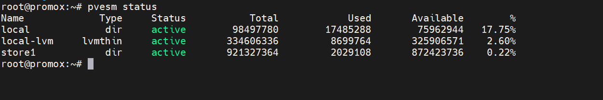
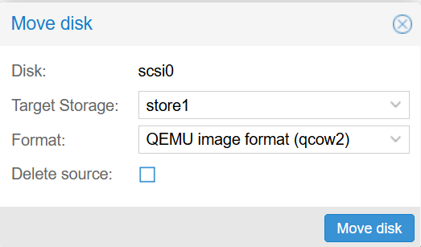
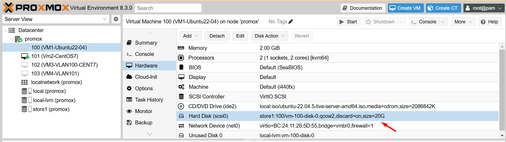

Để di chuyển các máy ảo (VM) giữa 2 data storage trong ảo hoá Proxmox, bạn có thể thực hiện các bước sau:

Kiểm tra trạng thái hiện tại của các data storage:

Sử dụng lệnh ``pvesm status`` để xem các data storage hiện có trong Proxmox.

  

## Di chuyển VM sang data storage mới sử dụng GUI

1. Chọn VM nơi cần di chuyển ổ đĩa ảo, ``stop VM`` và nhấp vào 

``Hardware`` > ``Hard Disk`` > ``Disk Action`` > ``Move Storage``

  

2. Chọn định dạng và lưu trữ mục tiêu.

Nếu Target Storage ở cấp độ tệp, Định dạng hỗ trợ ba loại định dạng ảnh đĩa ảo: Ảnh đĩa thô, định dạng ảnh QEMU (QCOW2) và định dạng ảnh VMware (VMDK). Proxmox VE đề xuất sử dụng định dạng ảnh QEMU.

Xóa nguồn:  Đây là tùy chọn xóa đĩa gốc. Vì lý do an toàn, nếu bạn lo ngại về các vấn đề tiềm ẩn khi di chuyển sang bộ lưu trữ mới hoặc nếu cần giữ một bản sao dự phòng, đừng chọn tùy chọn này.

  

3. Nhấp vào Di chuyển đĩa và đợi quá trình di chuyển đĩa hoàn tất.

  

4. Kiểm tra lại ổ cứng.

  