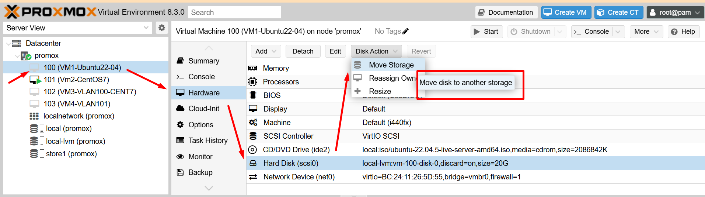
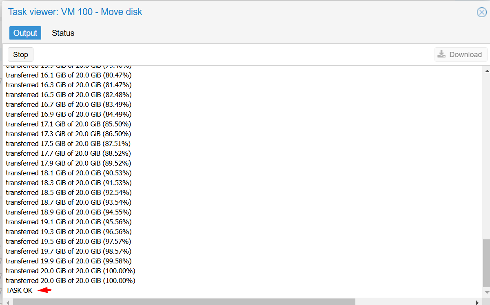
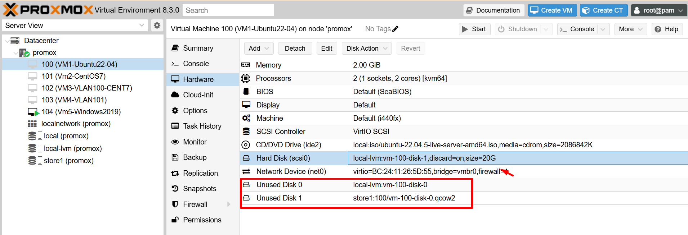
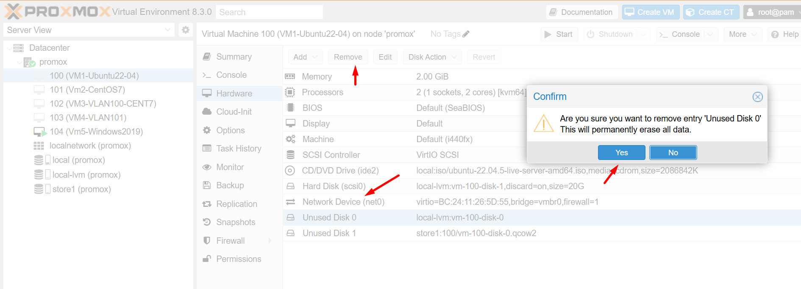
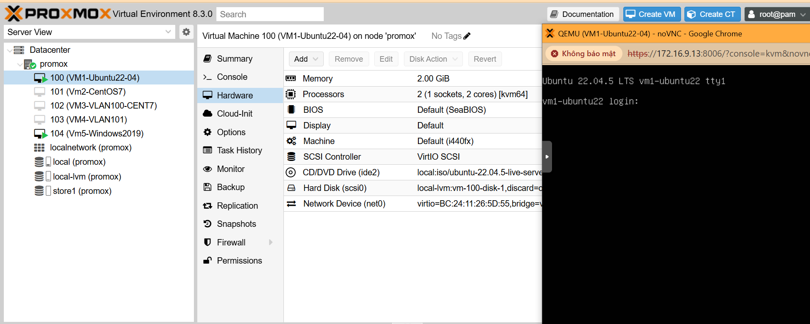

Để di chuyển các máy ảo (VM) giữa 2 data storage trong ảo hoá Proxmox, bạn có thể thực hiện các bước sau:

Kiểm tra trạng thái hiện tại của các data storage:

Sử dụng lệnh ``pvesm status`` để xem các data storage hiện có trong Proxmox.

  

## Di chuyển VM sang data storage mới sử dụng GUI

#### B1: Chọn VM nơi cần di chuyển ổ đĩa ảo.

``stop VM`` và nhấp vào 

``Hardware`` > ``Hard Disk`` > ``Disk Action`` 

> ``Move Storage``

  

#### B2: Chọn định dạng và lưu trữ mục tiêu.

Nếu Target Storage ở cấp độ tệp, Định dạng hỗ trợ ba loại định dạng ảnh đĩa ảo: Ảnh đĩa thô, định dạng ảnh QEMU (QCOW2) và định dạng ảnh VMware (VMDK). Proxmox VE đề xuất sử dụng định dạng ảnh QEMU.

Xóa nguồn:  Đây là tùy chọn xóa đĩa gốc. Vì lý do an toàn, nếu bạn lo ngại về các vấn đề tiềm ẩn khi di chuyển sang bộ lưu trữ mới hoặc nếu cần giữ một bản sao dự phòng, đừng chọn tùy chọn này.

  

#### B3: Nhấp vào Di chuyển đĩa và đợi quá trình di chuyển đĩa hoàn tất.

  

#### B4:  Kiểm tra lại ổ cứng.

  

## Di chuyển VM sang data storage mới sử dụng CLI

#### B1: Check storage status 

    root@promox:~# pvesm status
    Name             Type     Status           Total            Used       Available        %
    local             dir     active        98497780        18193332        75254900   18.47%
    local-lvm     lvmthin     active       334606336        17767596       316838739    5.31%
    store1            dir     active       921327364         7533392       866919452    0.82%

#### B2: Dừng máy ảo

Máy ảo có ID là 100

    root@promox:~# qm stop 100

#### B3: Kiếm tra config máy ảo

    root@promox:~# qm config 100
    boot: order=scsi0;ide2;net0
    cores: 2
    cpu: kvm64
    ide2: local:iso/ubuntu-22.04.5-live-server-amd64.iso,media=cdrom,size=2086842K
    memory: 2048
    meta: creation-qemu=9.0.2,ctime=1741084190
    name: VM1-Ubuntu22-04
    net0: virtio=BC:24:11:26:5D:55,bridge=vmbr0,firewall=1
    numa: 0
    ostype: l26
    scsi0: store1:100/vm-100-disk-0.qcow2,discard=on,size=20G  //``Thông tin source_disk``
    scsihw: virtio-scsi-pci
    smbios1: uuid=d48c0368-cc79-4499-8e27-bc792d777d3c
    sockets: 1
    unused0: local-lvm:vm-100-disk-0 
    vmgenid: c8e7078b-c2a4-4a1d-a06d-add67d57f042

#### B4: Chuyển máy ảo bằng lệnh ``qm move_disk VMID source_disk target_storage``

``source_disk`` ở đây là ``scsi0`` và ``target_storage`` ở đây là ``local-lvm``

    root@promox:~# qm move_disk 100 scsi0 local-lvm
    create full clone of drive scsi0 (store1:100/vm-100-disk-0.qcow2)
      Logical volume "vm-100-disk-1" created.
    transferred 0.0 B of 20.0 GiB (0.00%)
    transferred 204.8 MiB of 20.0 GiB (1.00%)
    transferred 411.6 MiB of 20.0 GiB (2.01%)
    transferred 620.5 MiB of 20.0 GiB (3.03%)
    ...
    ...
    transferred 19.6 GiB of 20.0 GiB (98.08%)
    transferred 19.8 GiB of 20.0 GiB (99.09%)
    transferred 20.0 GiB of 20.0 GiB (100.00%)
    transferred 20.0 GiB of 20.0 GiB (100.00%)
    root@promox:~#

#### B5: Kiểm tra start máy ảo.

  

Do mình làm LAB chuyển đi rồi chuyển lại giữa 2 data stora nên các disk nguyên bản vẫn còn,

  

Máy ảo khởi động thành công.

  