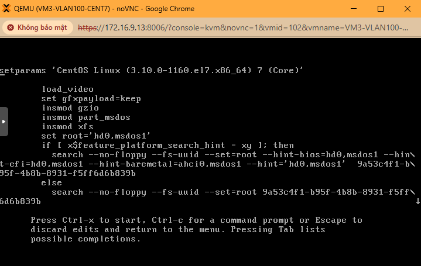
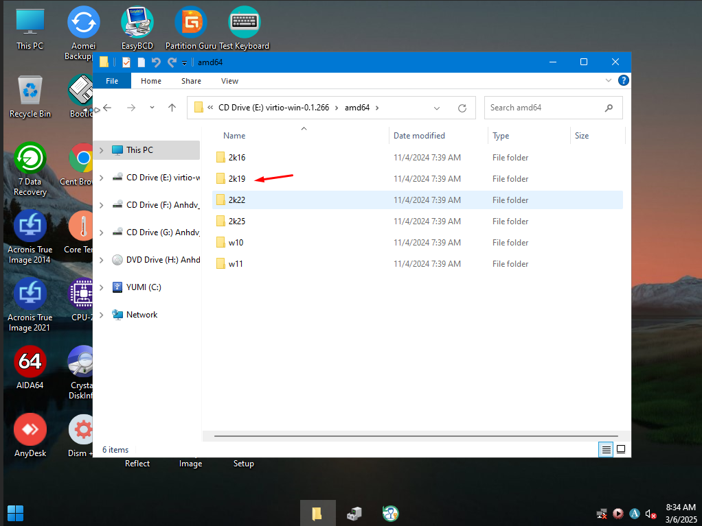
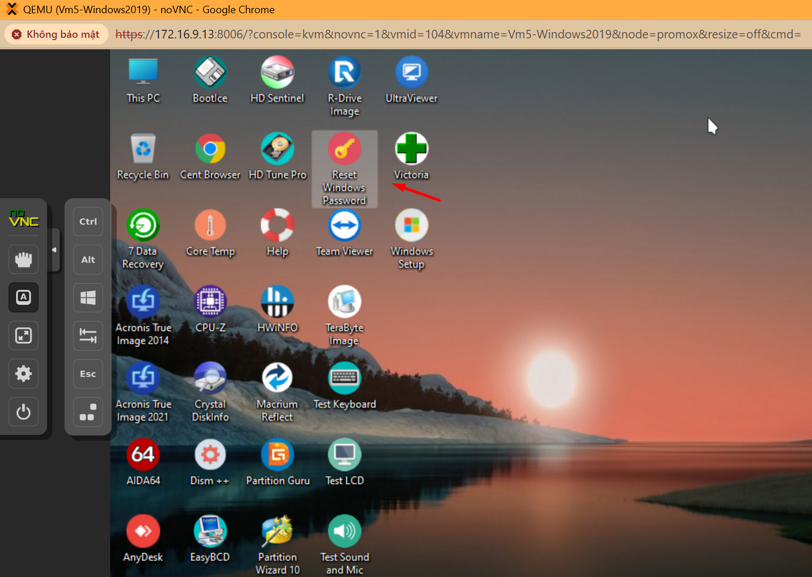
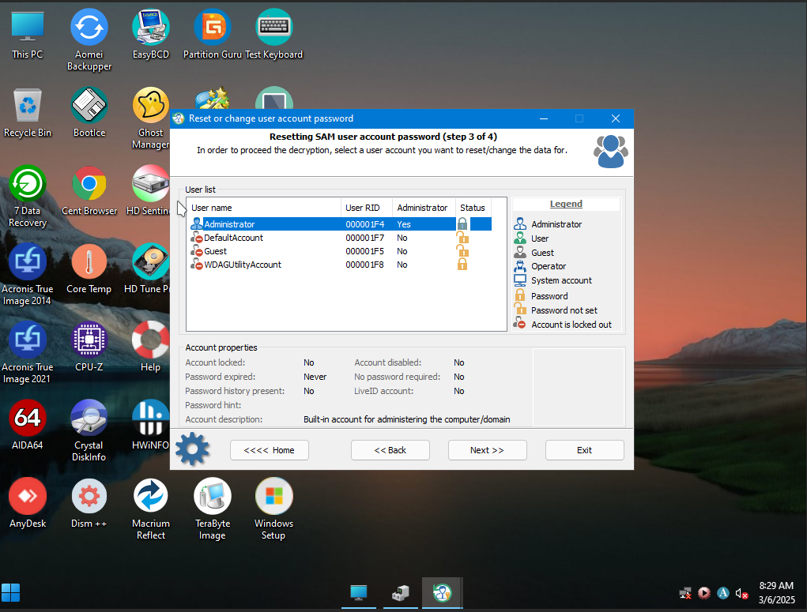
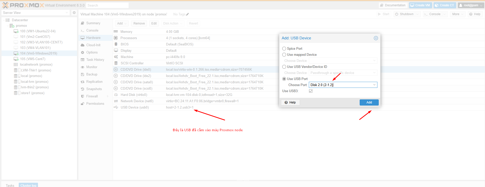
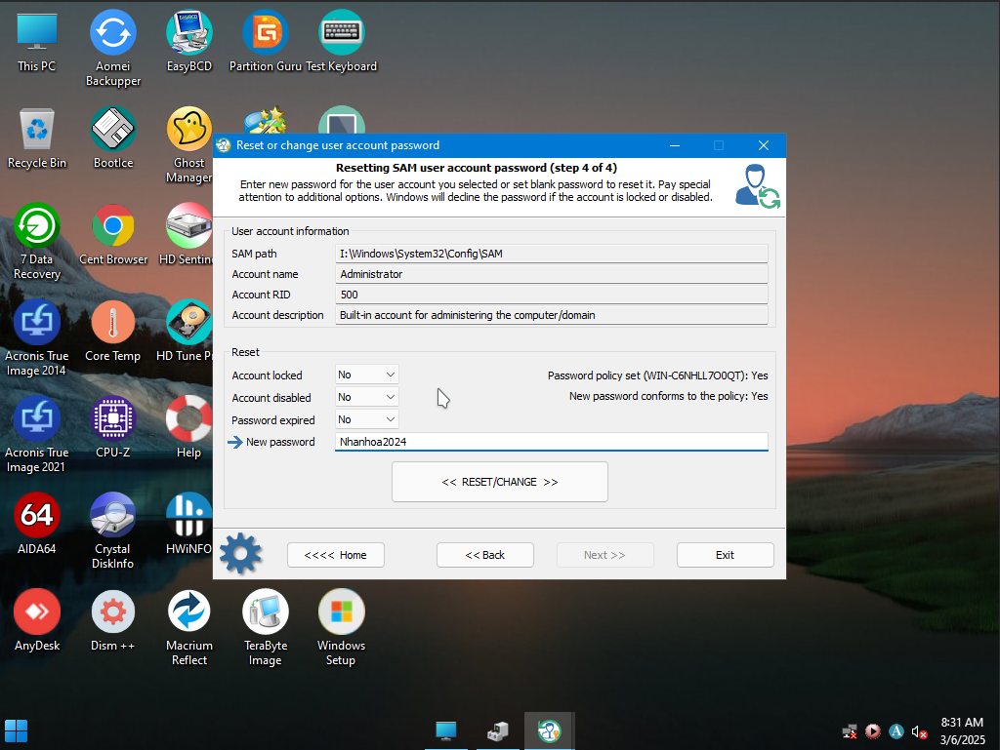
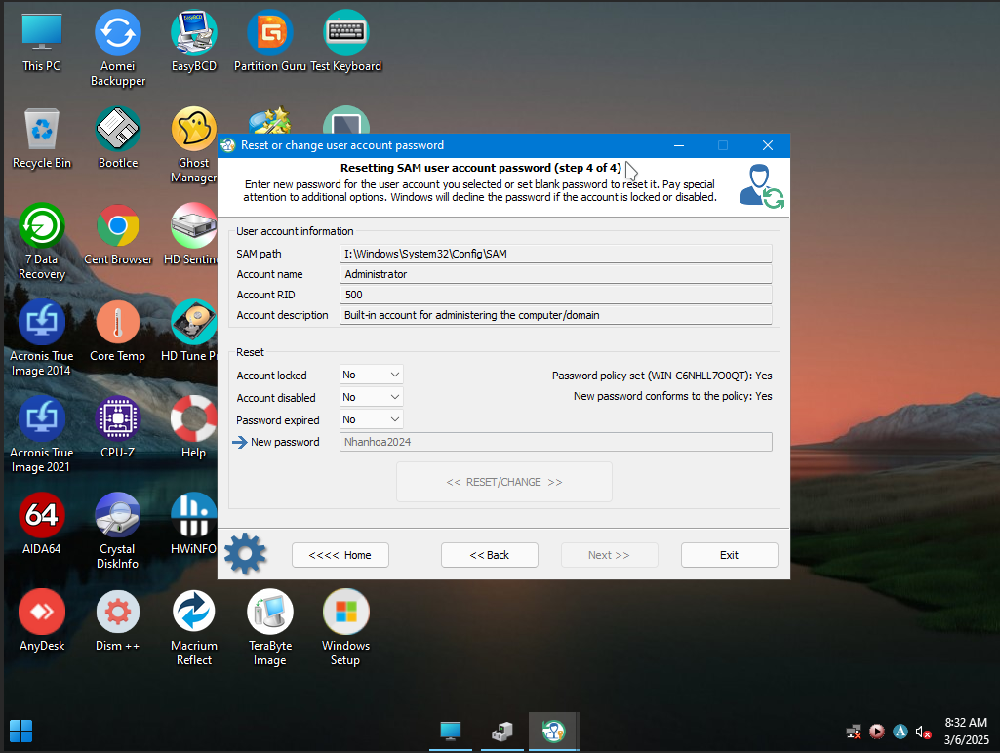
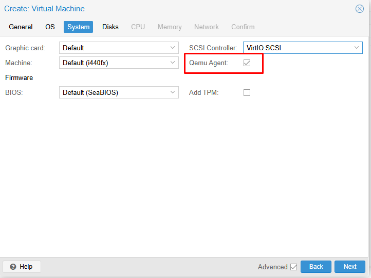

## Reset password VM Linux

Do có thể console vào VM và boot vào single mode để tiến hành thao tác reset password

Tùy từng distribute OS mà chúng ta có những setup config cụ thể

  

Ngoài ra qemu agent là tùy chọn cài đặt khi tạo máy cũng có thể giúp reset password (hoặc cloudinit - nâng cao)

  

## Reset password Windows

Gắn thêm 1 DVD/ISO ANHDV vào máy ảo,

Thao tác ``stop/start`` máy ảo , khi khởi động VM qua console,thấy logo ``Proxmox`` thì nhấn phím ``ESC``

Sau đó chọn boot vào iso ANHDV chúng ta sẽ thấy được phần mềm reset lại password

  

Ngoài ra còn chứng năng add Virtual USB map với USB vật lý cắm vào máy, cũng có khả năng cho chúng ta thêm 1 cách reset USB dùng AnhDVBoot hoặc Hiren's boot.

  

  

  

  

Lưu ý: Bạn boot vào iso dạng ANHDV cũng cần load driver Virtio để USB có thể detech được ổ đĩa.

  

Ngoài ra còn có các tùy chọn boot vào CD ISO WINDOWS hoặc thông qua qemu agent khi tạo máy cũng có thể giúp reset password windows (hoặc cloudinit - nâng cao)

  