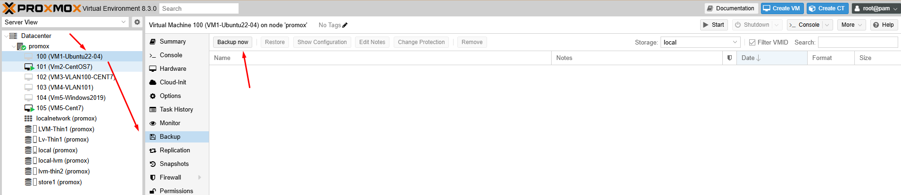
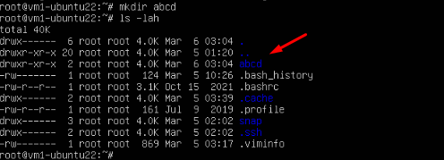
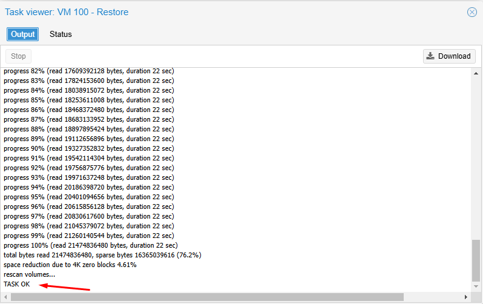
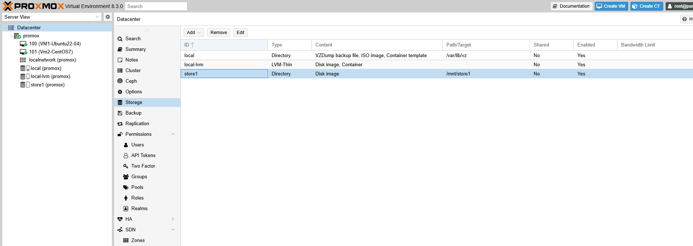
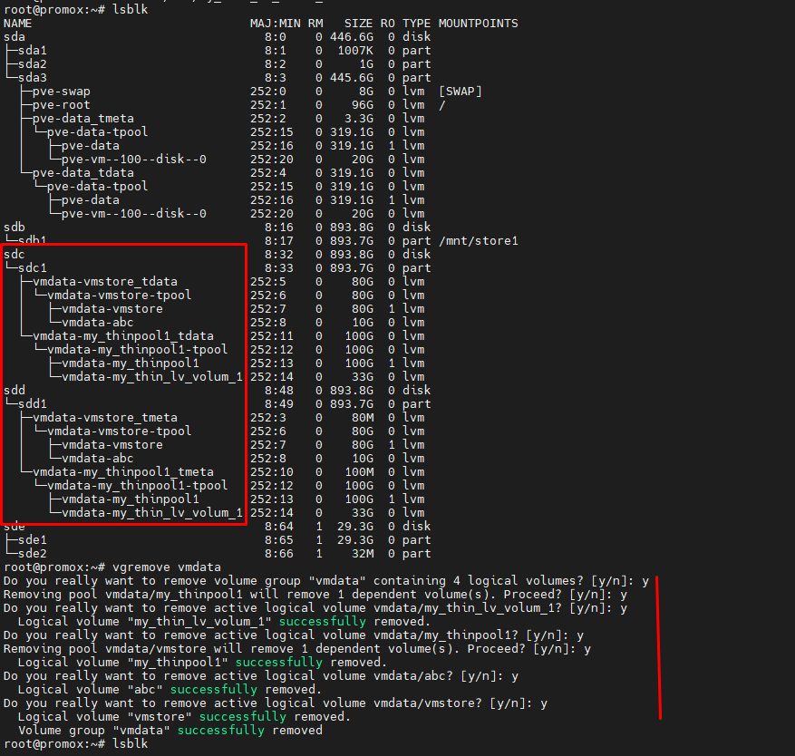

## Backup

  

### Các mode backup:

Trong ảo hóa Proxmox, có một số chế độ sao lưu máy ảo (VM) khác nhau, mỗi chế độ có ưu và nhược điểm riêng:

#### 1. Snapshot:

Ưu điểm:

    Sao lưu nhanh chóng, ngay cả khi VM đang chạy.
    Giảm thiểu thời gian ngừng hoạt động (downtime).
    Cho phép tạo nhiều điểm khôi phục.

Nhược điểm:

    Các snapshot phụ thuộc vào ổ đĩa gốc, nếu ổ đĩa gốc bị hỏng, các snapshot cũng có thể bị mất.
    Các snapshot có thể chiếm nhiều dung lượng lưu trữ nếu không được quản lý cẩn thận.
    Không đảm bảo tính nhất quán của dữ liệu ứng dụng.

Cách thức hoạt động: Proxmox tạo ra một bản sao của trạng thái ổ đĩa của VM tại thời điểm tạo snapshot.

#### 2. Suspend:

Ưu điểm:

    Đảm bảo tính nhất quán của dữ liệu.
    Thời gian ngừng hoạt động ngắn hơn so với chế độ Stop.

Nhược điểm:

    VM sẽ tạm dừng hoạt động trong quá trình sao lưu.
    Cách thức hoạt động: Proxmox tạm dừng VM, sau đó sao lưu trạng thái bộ nhớ và ổ đĩa.

#### 3. Stop:

Ưu điểm:

    Đảm bảo tính nhất quán dữ liệu cao nhất.
    Dữ liệu sẽ nhất quán trước và sau khi backup hoàn tất.

Nhược điểm:

    VM cần phải tắt hoàn toàn trong quá trình sao lưu, dẫn đến thời gian ngừng hoạt động lâu hơn.
    Cách thức hoạt động: Proxmox tắt VM, sau đó sao lưu toàn bộ ổ đĩa.
    Lựa chọn chế độ sao lưu:

#### Nhận định

  + Nếu bạn cần sao lưu nhanh chóng và giảm thiểu thời gian ngừng hoạt động, hãy sử dụng chế độ Snapshot.

  + Nếu bạn cần đảm bảo tính nhất quán dữ liệu và chấp nhận thời gian ngừng hoạt động ngắn, hãy sử dụng chế độ Suspend.

  + Nếu bạn cần đảm bảo tính nhất quán dữ liệu cao nhất và có thể chấp nhận thời gian ngừng hoạt động lâu, hãy sử dụng chế độ Stop.

  + Ngoài ra, Proxmox còn có thể tích hợp với Proxmox Backup Server, là một giải pháp sao lưu chuyên dụng, cung cấp nhiều tính năng nâng cao như:

    + Sao lưu gia tăng (incremental backups).
    + Chống trùng lặp dữ liệu (data deduplication).
    + Mã hóa dữ liệu.

### Test

    mkdir abcd

Backup:

  

    rm -f abcd

Restore:

Stop VM sau đó restore, kiểm tra thư mục abcd trong /root đã được khôi phục hay chưa

   

## Backup All VM theo chu kỳ định sẵn

Tại ``Datacenter`` > ``Backup`` > ``Add``

   

All VM được backup tại ``/var/lib/vz/dump`` nơi ``Storage Local`` được định nghĩa chứa backup 

   

 

