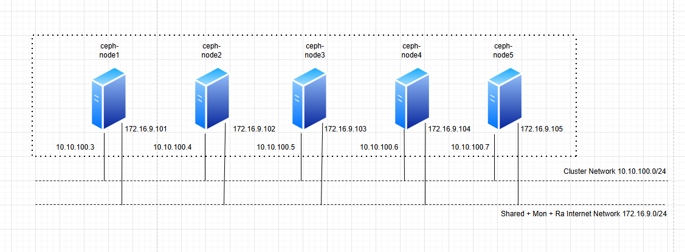
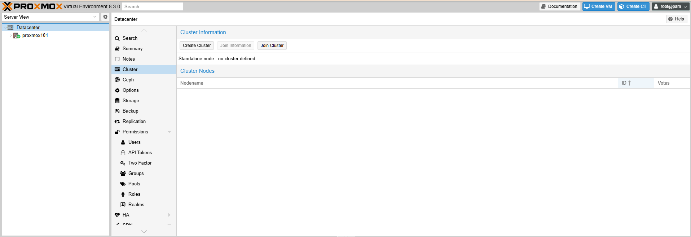
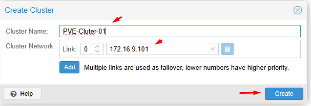
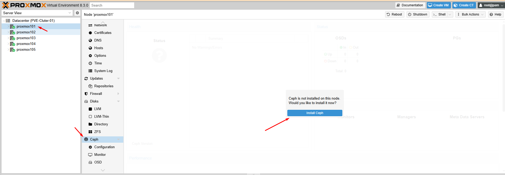

## Lý thuyết

Mình sẽ thực hiện bài LAB 5 node Proxmox tham gia vào cụm Cluster,sử dụng Ceph trên giao diện admin Proxmox.

Sơ đồ mình lên như hình vẽ

  

Mỗi Node Proxmox có cấu hình giống nhau để dễ xử lý

IP node 1: 172.16.9.101

IP node 2: 172.16.9.102

IP node 2: 172.16.9.103

IP node 2: 172.16.9.104

IP node 2: 172.16.9.105

Mỗi node có 1 ổ 100G cài OS và 3 ổ 50GB làm cụm Ceph : /dev/sda(100GB) + /dev/sdb + /dev/sdc + /dev/sdd

Do làm Lab nên mình chỉ sử dụng 1 mạng 172.16.9.x/20 để test và tạm tắt firewall

Chuẩn bị 5 máy proxmox và đảm bảo admin các node vào được

https://172.16.9.101-105:8006/

  

## Bước 1: 

Trên máy dự định làm Master của cụm click vào ``Datacenter`` > ``Cluster`` > ``Create Cluster``

  

  

Click vào Join infomation

  

Copy Join infomation

  

## Bước 2: 

Chúng ta sang các node tiếp theo có IP 172.16.9.102-105 làm y đúc như sau:

 Click vào ``Datacenter`` > ``Cluster`` > ``Join Cluster``

Hoàn thành Join các node vào cụm

  

## Bước 3:

Cài Ceph lần lượt các máy, bắt đầu từ máy ``Master``

  

  

Mình chọn ``Squid`` và ``No-Subscription``

  

  

  

  

  

Cài tương tự các node còn lại phần Ceph

## Bước 4:

Cài dịch vụ ``Monitor Ceph`` trên tất cả các node còn lại

Click vào máy ``Proxmox2`` > ``Ceph`` > ``Monitor`` > ``Create``

  

Hoàn thành

  

## Bước 5:

Tên các máy lần lượt từ Master 

Chúng ta click vào ``Ceph`` > ``OSD`` > ``Creater OSD``

Để mặc định cho nhanh

  

Thao tác với các ổ cứng 50GB đã gắn như ban đầu có đề cập

  

  

Làm tương tự tất cả trên các máy Proxmox còn lại

Hoàn thành ``create OSD`` trên cả 5 node:

  

## Bước 6: Create Pool

  

Click vào ``Proxmox1`` Master  > ``Ceph`` > ``Pools`` > ``Create Pools``

  

  

Sau khi tạo pool xong chúng ta thấy Pool Storage Ceph này đã được kết nối trên tất cả các node

  

  

## Bước 7: Tạo VM ở Pool này.

  

  

  

  

## Bước 8: 

Lựa chọn VM HA

Chúng ta click vào ``Datacente``r > ``HA`` , phần ``Resources`` chọn ``Create``

  

  + Max. Restart: Số lần khởi động lại tối đa trên node khác. 2 là đủ.
  + Max Relocate: Số lần di chuyển tối đa sang node khác. 2 là đủ.
  + Request State: để "started" để VM luôn ở trạng thái chạy

  + Groups ( cực quan trọng vì nó quyết định VM đi đâu nếu Node lỗi - tạo nhóm bên dưới và quay lại đây để thêm VM vào Groups HA tùy chọn )

  

Và bạn thắc mắc VM sẽ được move sang node nào nếu bị lỗi, chúng ta xử lý như sau:

Tại ``Datacenter`` > ``HA`` > ``Groups`` > ``Create``

Trong ảnh bạn cung cấp, cột "Priority" (Ưu tiên) trong phần cấu hình HA Group (Nhóm tính sẵn sàng cao) của Proxmox VE xác định thứ tự ưu tiên của các node trong cluster để chạy các máy ảo (VM) thuộc nhóm HA này.

Giá trị Priority càng cao, node đó càng được ưu tiên chạy VM của nhóm HA.

Khi một VM trong nhóm HA cần khởi động lại (ví dụ: do lỗi node), Proxmox VE sẽ cố gắng khởi động nó trên node có Priority cao nhất còn hoạt động.

Vì vậy Cluster là dự phòng, Proxmox105 là node mình chọn dự phòng, mình sẽ tạo 4 nhóm để Proxmox105 có giá trị Priority thấp nhất

Còn lại các node mình để Priority bằng nhau.

  

  

Tùy từng tình huống số lượng VM , tài nguyên đang chạy trên compute trên các node mà bạn có cài đặt cụ thể.

## Bước 9: Test HA VM

- Test Live Migrate VM không downtime (đảm bảo gỡ CD/DVD iso đã gắn vào VM để test):

    VM2-test có IP: 172.16.2.x live migrate từ node 2 sang node 1 >> ping VM không thấy mất gói :

- Test Node Down: VM tự chuyển sang node khác 

    Stop đồng thời node 2 node >> xem các VM chuyển đi đâu

