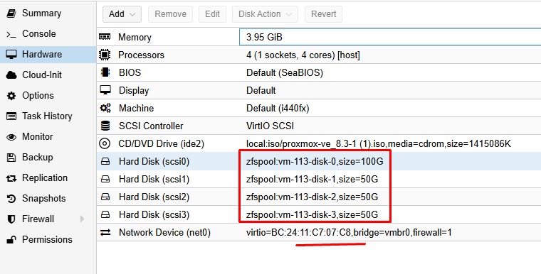

## Lý thuyết

Mình sẽ thực hiện bài LAB 5 node Proxmox tham gia vào cụm Cluster

Sơ đồ mình lên như hình vẽ

Chi tiết như sau:

  

Mỗi Node Proxmox có cấu hình giống nhau để dễ xử lý

IP node 1: 172.16.9.101
IP node 2: 172.16.9.102
IP node 2: 172.16.9.103
IP node 2: 172.16.9.104
IP node 2: 172.16.9.105

Mỗi node có 1 ổ 100G cài OS và 3 ổ 50GB làm Ceph : /dev/sda + /dev/sdb + /dev/sdc + /dev/sdd

  

Do làm Lab nên mình chỉ sử dụng 1 mạng 172.16.9.x/20 để test và tạm tắt firewall

