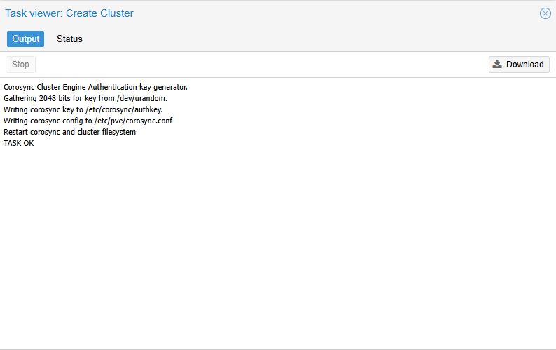
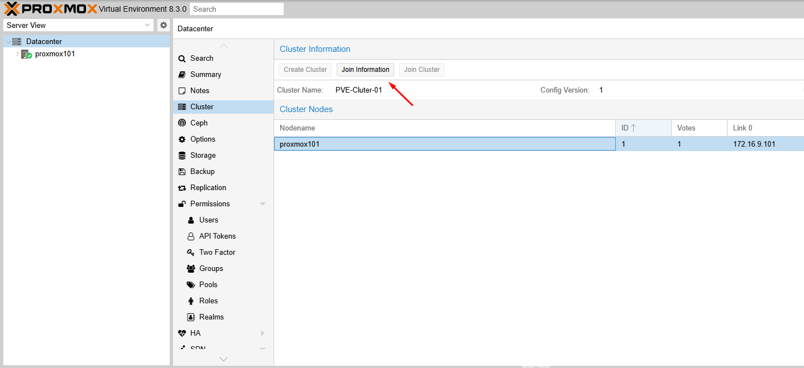
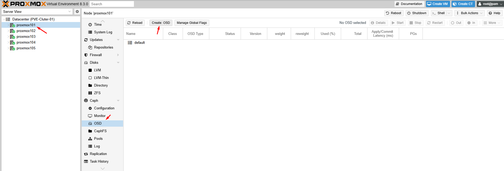
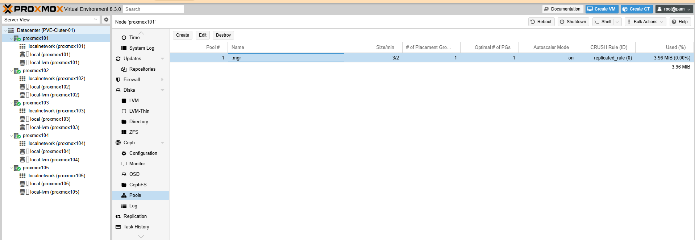
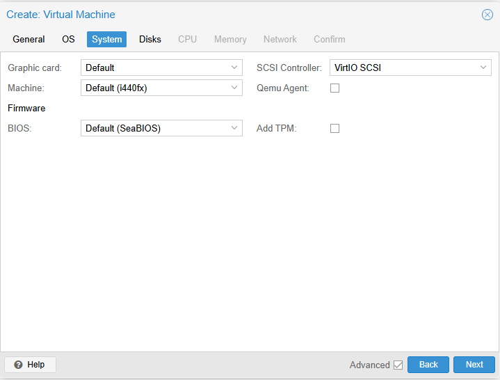
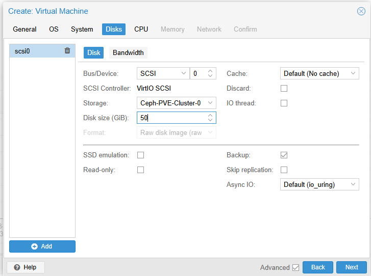

## Lý thuyết

Mình sẽ thực hiện bài LAB 5 node Proxmox tham gia vào cụm Cluster

Sơ đồ mình lên như hình vẽ

Chi tiết như sau:

  

Mỗi Node Proxmox có cấu hình giống nhau để dễ xử lý

IP node 1: 172.16.9.101
IP node 2: 172.16.9.102
IP node 2: 172.16.9.103
IP node 2: 172.16.9.104
IP node 2: 172.16.9.105

Mỗi node có 1 ổ 100G cài OS và 3 ổ 50GB làm Ceph : /dev/sda(100GB) + /dev/sdb + /dev/sdc + /dev/sdd

  

Do làm Lab nên mình chỉ sử dụng 1 mạng 172.16.9.x/20 để test và tạm tắt firewall

Đảm bảo admin các node vào được

https://172.16.9.101-105:8006/

  

## Bước 1: 

Trên máy dự định làm Master của cụm click vào Datacenter > Cluster > Create Cluster

  

  

Click vào Join infomation

  

Copy Join infomation

  

## Bước 2 

Chúng ta sang các node tiếp theo có IP 172.16.9.102-105 làm y đúc như sau:

 Click vào Datacenter > Cluster > Join Cluster

  

Hoàn thành Joine các node vào cụm

  

## Bước 3

Cài Ceph lần lượt các máy, bắt đầu từ máy Master

  

Mình chọn Squid và No-Subscription

  

Yes để máy tự cài

  

  

  

  

  

Cài tương tự các node còn lại phần Ceph

## Bước 4

Cài dịch vụ Monitor Ceph trên tất cả các node còn lại

Click vào máy Proxmox2 > Ceph > Monitor > Create

  

Hoàn thành

  

## Bước 5

Tên các máy lần lượt từ Master 

Chúng ta click vào OSD > Creater OSD

Để mặc định cho nhanh

  

Thao tác với các ổ cứng 50GB đã gắn như ban đầu có đề cập

  

  

Làm tương tự tất cả trên các máy Proxmox còn lại

Hoàn thành create OSD trên cả 5 node:

  

## Bước 6 Create Pool

  

Click vào Proxmox1 Master  > Ceph > Pools > Create Pools

  

  

Sau khi tạo pool xong chúng ta thấy Pool Storage Ceph này đã được kết nối trên tất cả các node

  

  

## Bước 7 Tạo VM ở Pool này.

  

  

  

  

