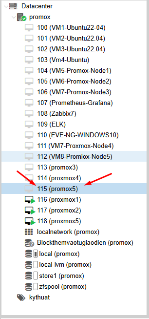
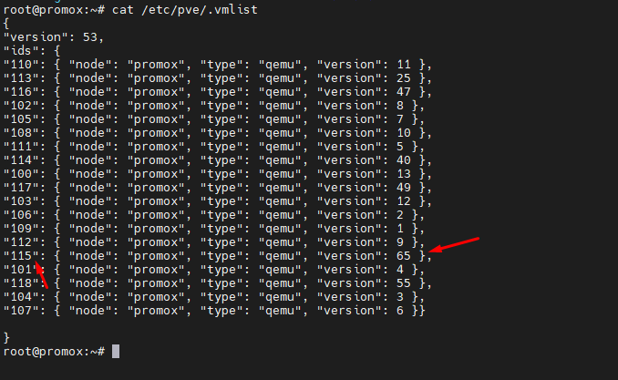
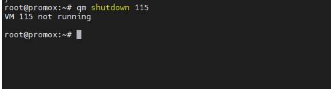
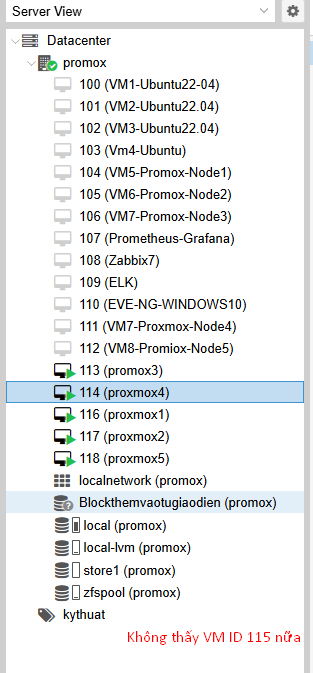

## Đôi khi gặp tình trạng lag không xóa được VM qua giao diện, chúng ta sẽ xử lý qua CLI

Đầu tiên ssh vào node Proxmox

### Bước 1: Show VM list

    cat /etc/pve/.vmlist

Mình muốn xóa VM có ID là 115

  

  

### Bước 2: Stop hoặc shutdown VM đang running

    qm shutdown [vmid]

>>
    
    qm shutdown 115 

  

### Bước 3: Destroy bằng lệnh sau:

    qm destroy [vmid]

>>

    qm destroy 115

  

