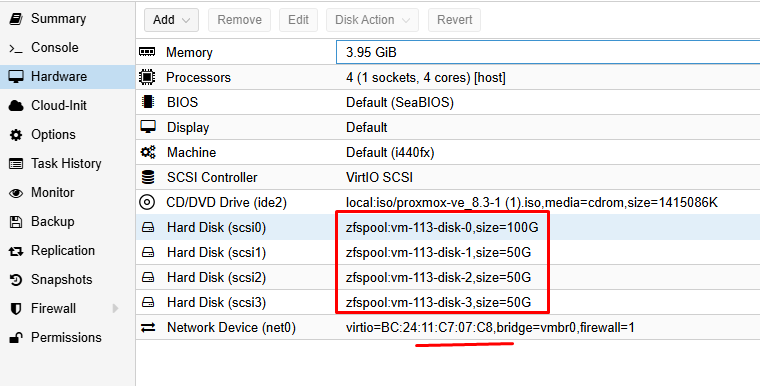
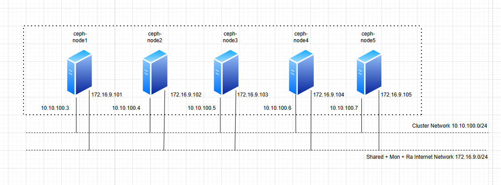
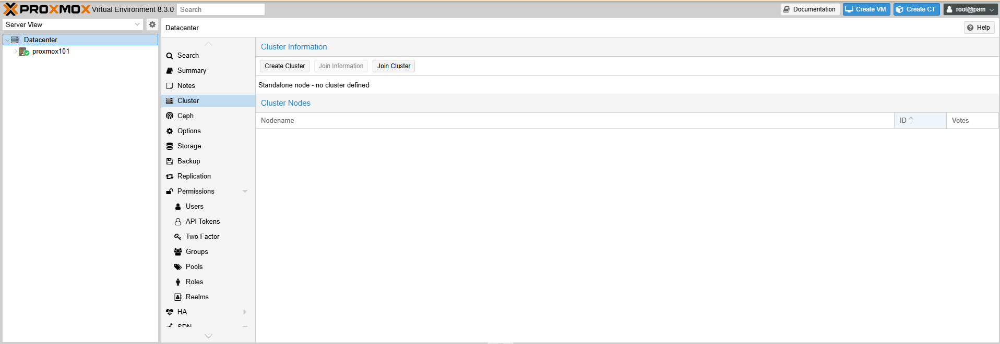
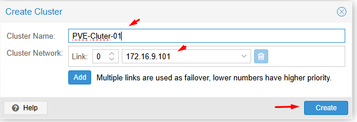

## Đây là tính năng chia sẻ data giữa các Proxmox Node

Tại Proxmox Master > CephFs > Create

  

Create Cephfs

  

  

  

Sau khi tạo xong

Tại ``Datacenter`` chúng ta xem ``Storage``

  

Pools ``CephFs`` được tạo và mount vào các Proxmox tại ``/mnt/pve/cephfs``

  
  

Có thể dùng để chứa file, backup các VM trong cụm...

