## Cài đặt Proxmox OS

Link tải ISO:

https://www.proxmox.com/en/downloads/proxmox-virtual-environment/iso

Mình cài đặt trên Server Dell qua công cụ iDRAC

 + B1 : Tải iso và map drive

  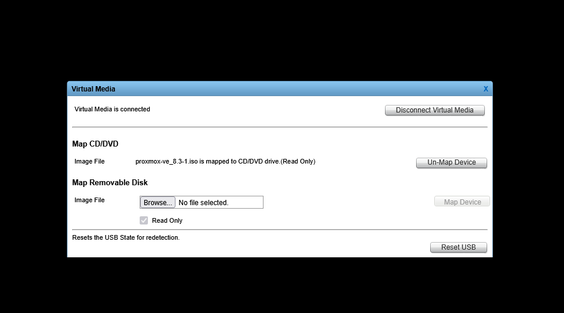

 + B2 : Chọn thứ tự boot

  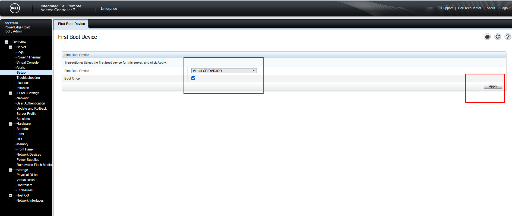

 + Chọn cài đặt đầu tiên (Proxmox VE - Đồ họa)

  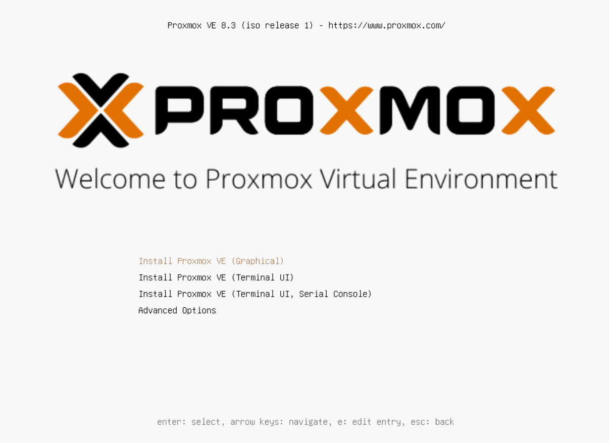
  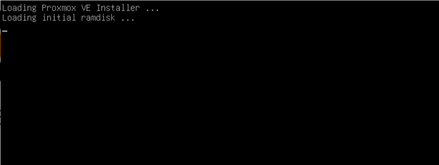
  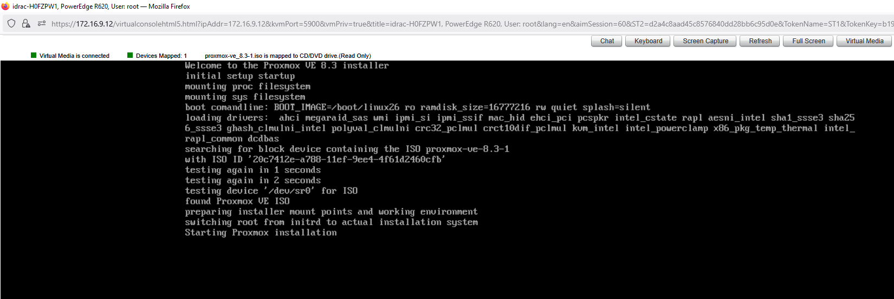
  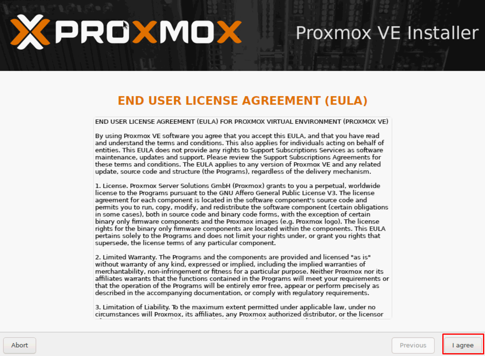
  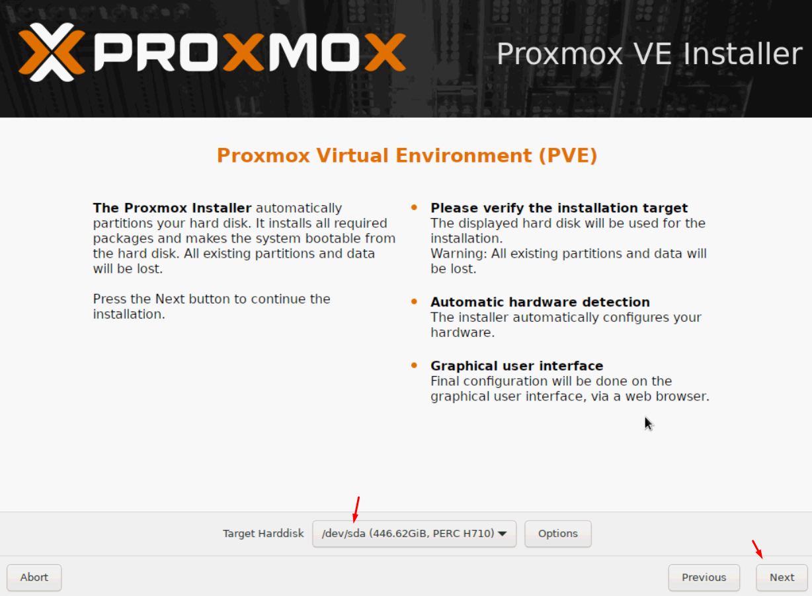
  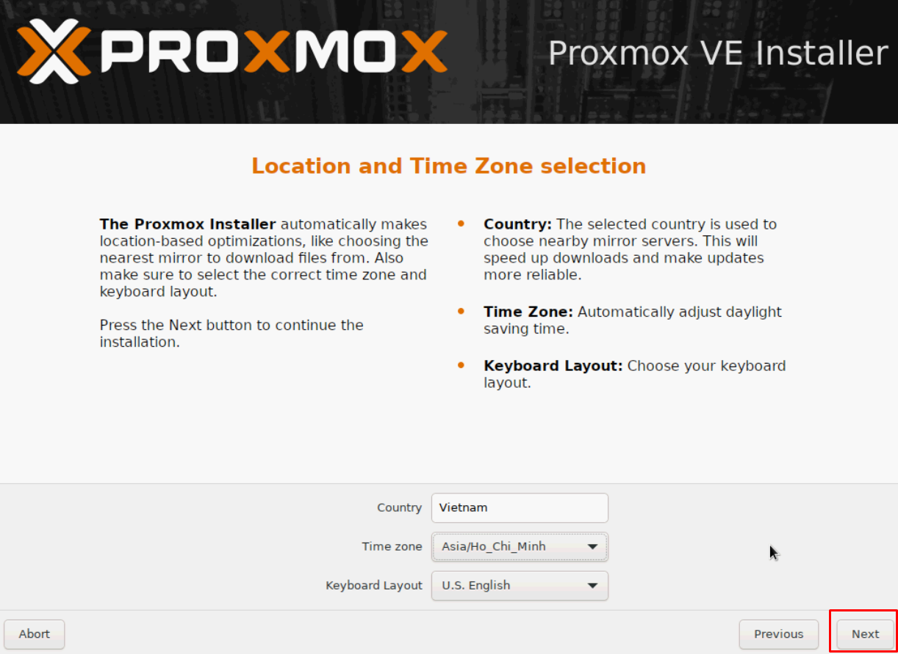

Nhập mật khẩu Nhanhoa2025 cho tài khoản root và địa chỉ email. Bấm Next

  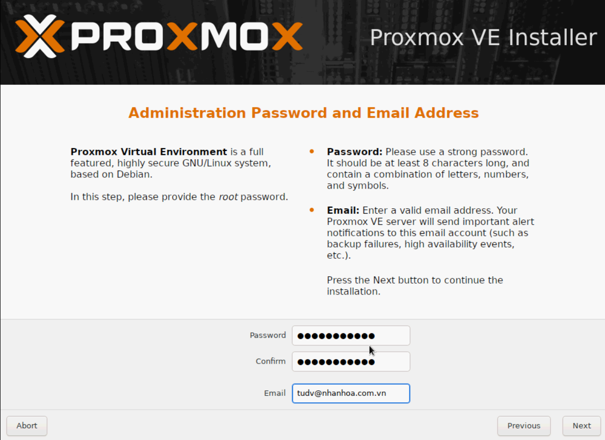

Thiết lập địa chỉ IP tĩnh cho máy Proxmox. Rồi bấm Next

  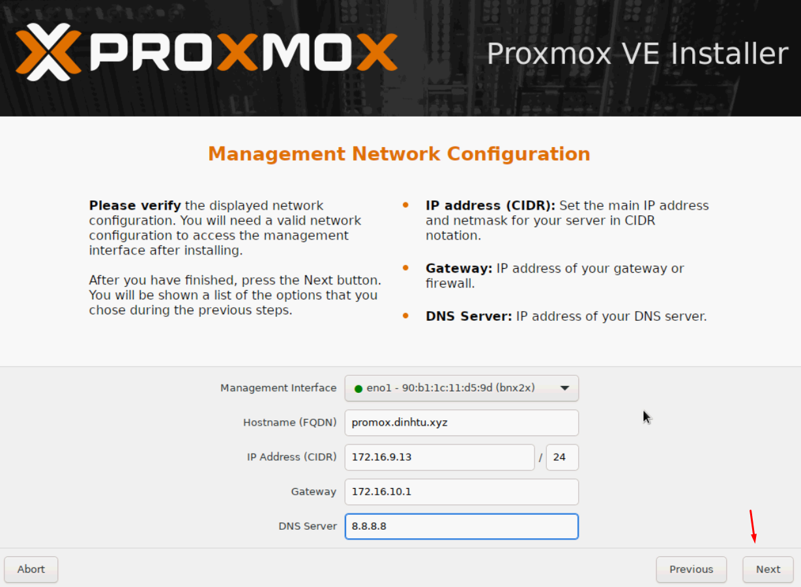

Kiểm tra lại các thông tin và chọn install

  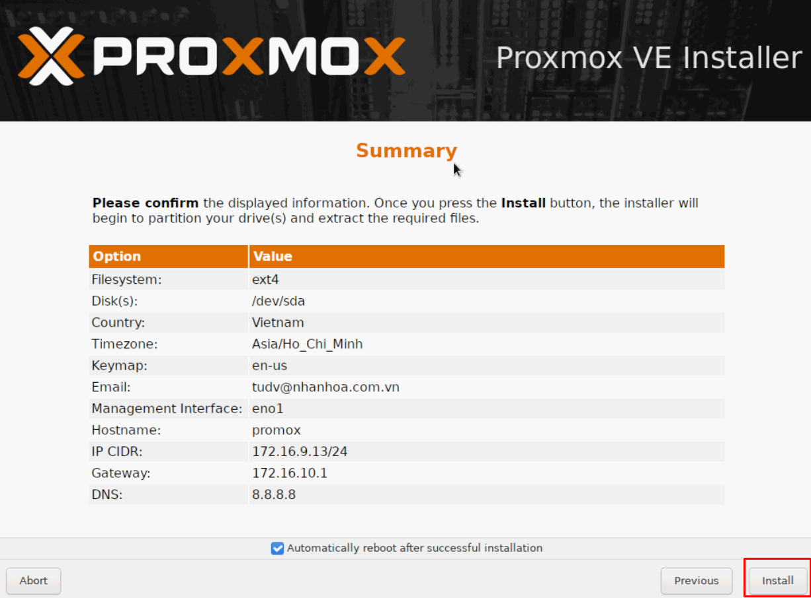

Quá trình cài đặt sẽ kéo dài khoảng 5-10 phút tuỳ vào cấu hình máy

  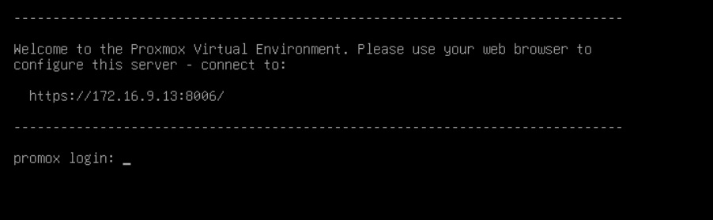

Hình ảnh giao diện login ban đầu

  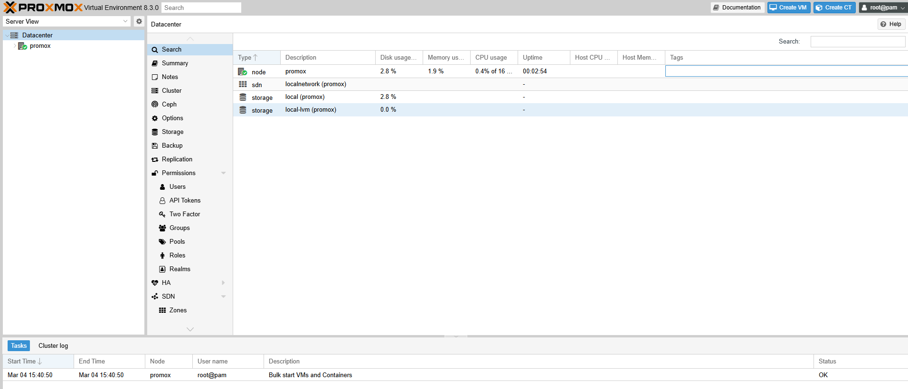

#### Views đầu tiên về ổ đĩa

  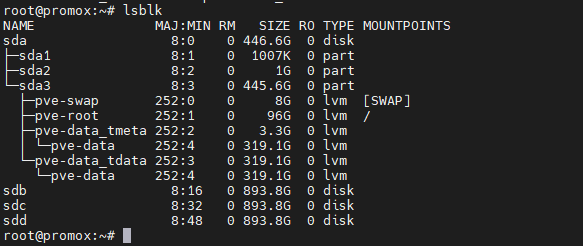