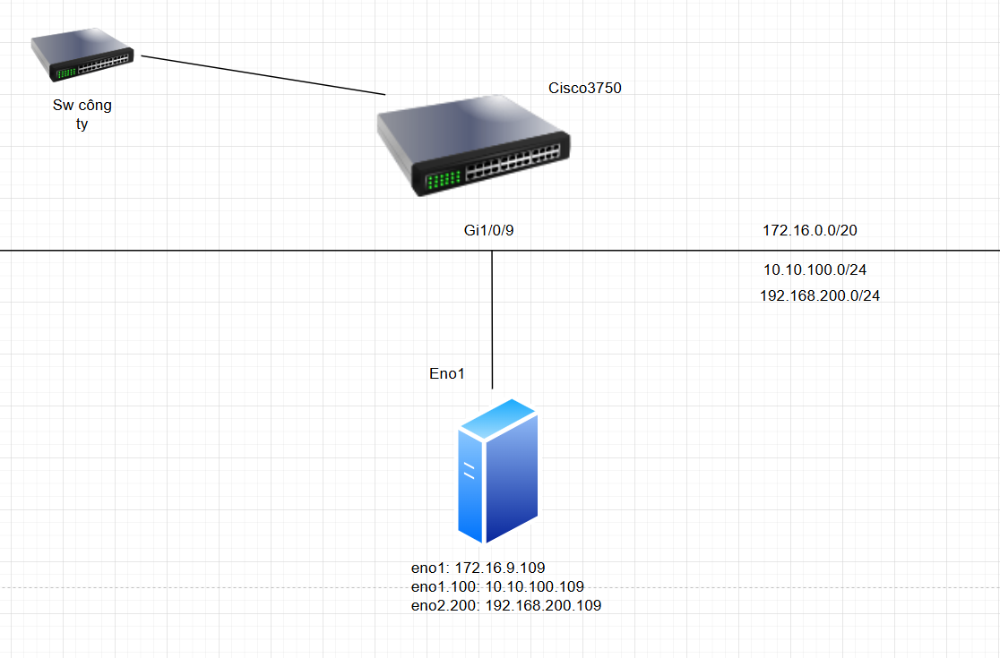
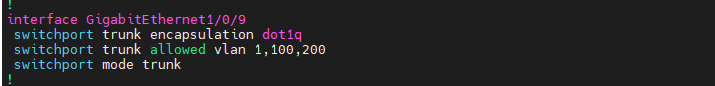
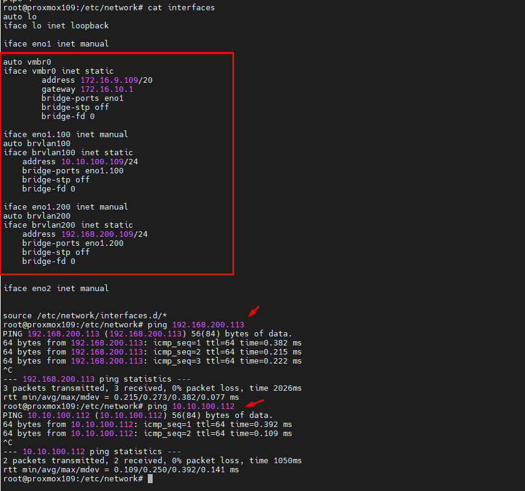

Cho topo như hình vẽ, chúng ta sẽ cấu hình network trên proxmox và thiết bị switch cisco mục đích mô phỏng multi vlan
  
  

Do server die cổng eno2 + phần eno2 mình đã làm ở mục trước nên lần này mình làm all in one vlan sử dụng eno1

## 2. Config switch

Trên thiết bị switch cisco mình cấu hình như sau, đầu tiên chúng ta ssh vào switch theo IP ``172.16.9.14`` với tài khoản ``admin`` và pass ``12345678aA@``

Khai báo thêm 2 ``vlan 100`` và ``vlan 200`` 

########### Khai báo VLAN 100 và VLAN 200 ( nếu đã khai báo rồi thì bỏ qua )

    Switch(config)#vlan 100
    Switch(config-vlan)#name VlanProxmoxCephLocal1
    Switch(config-vlan)#exit

    Switch(config)#vlan 200
    Switch(config-vlan)#name VlanProxmoxCephLoca2
    Switch(config-vlan)#exit

###########  No shut các port GigabitEthernet 1/0/9 và cấu hình trunking chỉ cho vlan 100,200 chạy qua ( nếu cho chạy qua all vlan thì đổi lệnh ``switchport trunk allowed vlan 100,200`` -> ``switchport trunk allowed vlan all``)

    Switch(config)#interface GigabitEthernet 1/0/09
    Switch(config-if)#description -> 172.16.9.109-10.10.100.109-192.168.200.109
    Switch(config-if)#no shutdown 
    swcore1(config-if)#sw trunk encapsulation dot1q
    Switch(config-if)#switchport mode trunk
    swcore1(config-if)#switchport trunk allowed vlan 1,100,200

  

    auto lo
    iface lo inet loopback

    iface eno1 inet manual

    auto vmbr0
    iface vmbr0 inet static
            address 172.16.9.109/20
            gateway 172.16.10.1
            bridge-ports eno1
            bridge-stp off
            bridge-fd 0

    iface eno1.100 inet manual
    auto brvlan100
    iface brvlan100 inet static
        address 10.10.100.109/24
        bridge-ports eno1.100
        bridge-stp off
        bridge-fd 0

    iface eno1.200 inet manual
    auto brvlan200
    iface brvlan200 inet static
        address 192.168.200.109/24
        bridge-ports eno1.200
        bridge-stp off
        bridge-fd 0

    iface eno2 inet manual

    source /etc/network/interfaces.d/*

  
