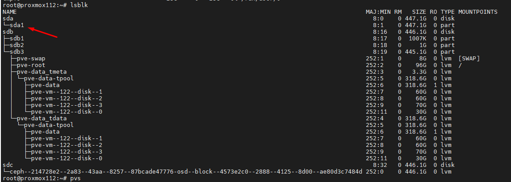
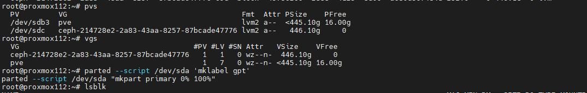

Docs lại việc mở rộng ``/dev/pve/root`` trên Proxmox

  

Cắm thêm ổ ``sda`` vào để tăng dung lượng cho ``/dev/pve/root`` hiện tại ``/dev/pve/root`` đang mount vào ``/`` của OS

  

    root@proxmox112:~# pvs
      PV         VG                                        Fmt  Attr PSize    PFree
      /dev/sdb3  pve                                       lvm2 a--  <445.10g 16.00g
      /dev/sdc   ceph-214728e2-2a83-43aa-8257-87bcade47776 lvm2 a--   446.10g     0
    root@proxmox112:~# vgs
      VG                                        #PV #LV #SN Attr   VSize    VFree
      ceph-214728e2-2a83-43aa-8257-87bcade47776   1   1   0 wz--n-  446.10g     0
      pve                                         1   7   0 wz--n- <445.10g 16.00g
    root@proxmox112:~# parted --script /dev/sda 'mklabel gpt'
    parted --script /dev/sda "mkpart primary 0% 100%"

    root@proxmox112:~# pvcreate /dev/sda1
    WARNING: ext4 signature detected on /dev/sda1 at offset 1080. Wipe it? [y/n]: y
      Wiping ext4 signature on /dev/sda1.
      Physical volume "/dev/sda1" successfully created.

    root@proxmox112:~# pvs
      PV         VG                                        Fmt  Attr PSize    PFree
      /dev/sda1                                            lvm2 ---  <447.13g <447.13g
      /dev/sdb3  pve                                       lvm2 a--  <445.10g   16.00g
      /dev/sdc   ceph-214728e2-2a83-43aa-8257-87bcade47776 lvm2 a--   446.10g       0

    root@proxmox112:~# vgs
      VG                                        #PV #LV #SN Attr   VSize    VFree
      ceph-214728e2-2a83-43aa-8257-87bcade47776   1   1   0 wz--n-  446.10g     0
      pve                                         1   7   0 wz--n- <445.10g 16.00g

    root@proxmox112:~# vgextend pve /dev/sda1
      Volume group "pve" successfully extended

    root@proxmox112:~# vgs
      VG                                        #PV #LV #SN Attr   VSize    VFree
      ceph-214728e2-2a83-43aa-8257-87bcade47776   1   1   0 wz--n-  446.10g       0
      pve                                         2   7   0 wz--n- <892.23g <463.13g

    root@proxmox112:~# lvextend -l +100%FREE /dev/pve/root
      Size of logical volume pve/root changed from 96.00 GiB (24576 extents) to <559.13 GiB (143137 extents).
      Logical volume pve/root successfully resized.

    root@proxmox112:~# resize2fs /dev/pve/root
    resize2fs 1.47.0 (5-Feb-2023)
    Filesystem at /dev/pve/root is mounted on /; on-line resizing required
    old_desc_blocks = 12, new_desc_blocks = 70
    The filesystem on /dev/pve/root is now 146572288 (4k) blocks long.

  

