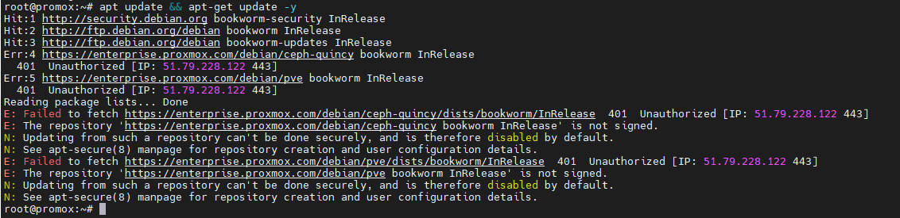
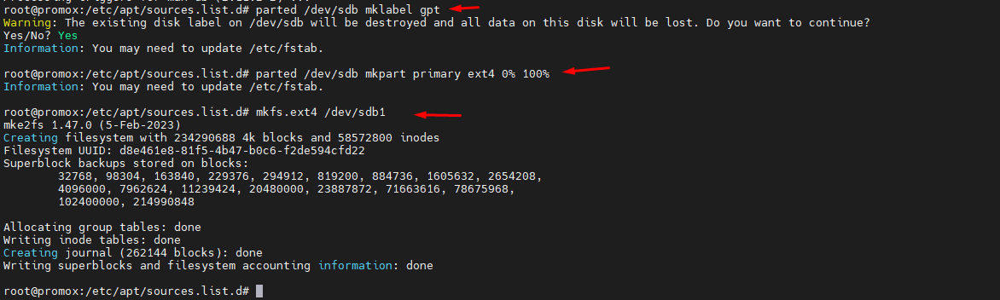
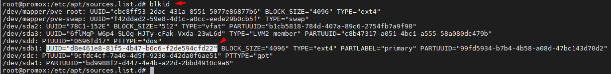
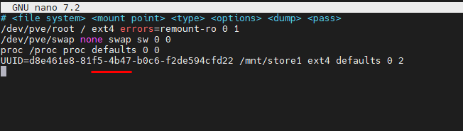
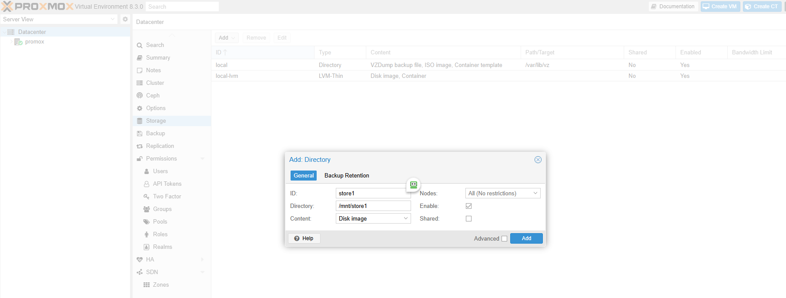
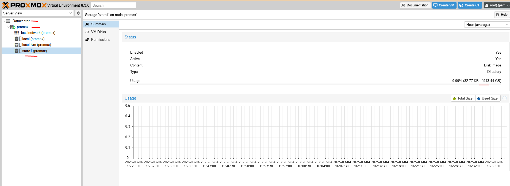

## Phân vùng ổ cứng
#### Update hệ thống

  \

Chà, chưa gì đã báo lỗi liên quan đến việc connect đến các repos để fetch metadata

Mình comment tạm:

    root@promox:/etc/apt/sources.list.d# ls -lah
    total 16K
    drwxr-xr-x 2 root root 4.0K Mar  4 16:10 .
    drwxr-xr-x 9 root root 4.0K Mar  4 16:04 ..
    -rw-r--r-- 1 root root   75 Mar  4 16:06 ceph.list
    -rw-r--r-- 1 root root   71 Mar  4 16:06 pve-enterprise.list

    root@promox:/etc/apt/sources.list.d# cat ceph.list
    #deb https://enterprise.proxmox.com/debian/ceph-quincy bookworm enterprise
    root@promox:/etc/apt/sources.list.d# cat pve-enterprise.list
    #deb https://enterprise.proxmox.com/debian/pve bookworm pve-enterprise
    root@promox:/etc/apt/sources.list.d# apt update && apt-get update -y

    root@promox:/etc/apt/sources.list.d# apt -y install parted

### Bước 1: Kiểm tra Ổ Cứng Mới

Nhập lệnh:

    lsblk

Views đầu tiên về ổ đĩa

  

Chúng ta thấy còn 3 ổ sdb sdb sdc đã cắm vào nhưng chưa được định dạng

    sdb                  8:16   0 893.8G  0 disk
    sdc                  8:32   0 893.8G  0 disk
    sdd                  8:48   0 893.8G  0 disk

### Bước 2: Tạo Partition và Định Dạng Ổ Cứng

#### 1. Tạo bảng phân vùng GPT** trên ổ đĩa (nếu chưa có):

    parted /dev/sdb mklabel gpt

#### 2. Tạo phân vùng** cho ổ đĩa:

    parted /dev/sdb mkpart primary ext4 0% 100%

#### 3. Định dạng phân vùng** (nếu cần, định dạng với hệ thống file `ext4`):

    mkfs.ext4 /dev/sdb1

  

### Bước 3: Mount Ổ Cứng

#### 1. Tạo thư mục để mount ổ đĩa:

   mkdir /mnt/store1

#### 2. Mount ổ đĩa vào thư mục mới:

   mount /dev/sdb1 /mnt/store1

#### 3. Để tự động mount sau khi khởi động lại, hãy thêm dòng này vào file `/etc/fstab`:

  
  

    UUID=d8e461e8-81f5-4b47-b0c6-f2de594cfd22 /mnt/store1 ext4 defaults 0 2

#### 4: Thêm Ổ Cứng vào Storage của Proxmox

  1. Truy cập giao diện quản lý Proxmox.

  2. Vào **Datacenter > Storage** và nhấn **Add**.

  3. Chọn loại storage là **Directory** và đặt tên cho storage này.

  4. Chỉ định đường dẫn là `/mnt/store1`, rồi chọn loại nội dung lưu trữ (VD: Disk image, ISO).

  

5. Nhấn **Add** để hoàn tất.

  

Ổ cứng mới giờ đã sẵn sàng sử dụng cho việc lưu trữ máy ảo hoặc các nội dung khác trên Proxmox.