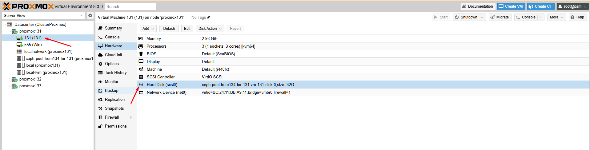
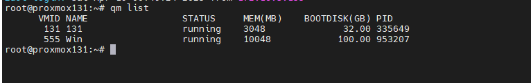
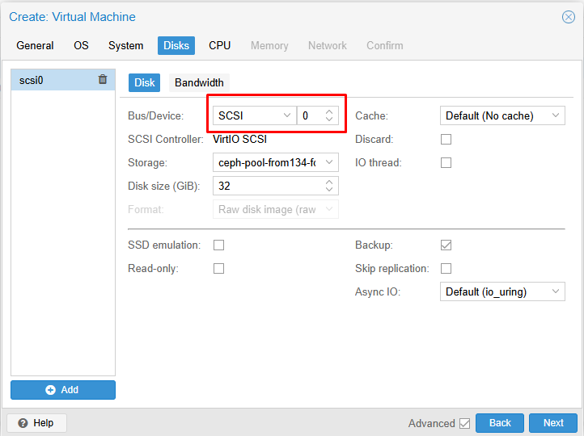
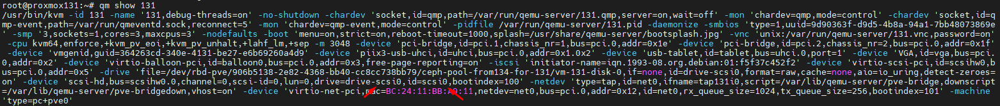
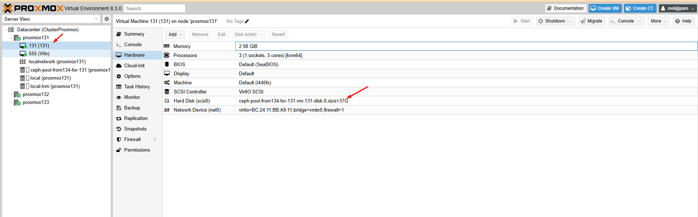

Tham khảo:

https://pve.proxmox.com/wiki/Resize_disks

Máy ảo đang có thông tin như sau trên giao diện:

  

  

Khi máy ảo được tạo ra Bus/Device của nó là SCSI 0

  

    qm show 131

Chúng ta thấy disk OS là sisi0

  

    qm resize 131 scsi0 +5G

  