## Tạo VM cơ bản

### Upload iso

Chúng ta vào giao diện quản trị Proxmox chọn ``Proxmox`` > ``Local (proxmox)`` > ``ISO Images`` > ``Upload``

  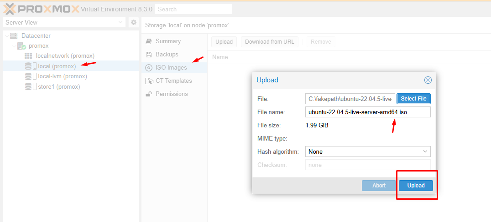

### Tạo VM

#### Bước 1: Chọn create VM

Chúng ta click ``Create VM``  tại góc phải bên trên

  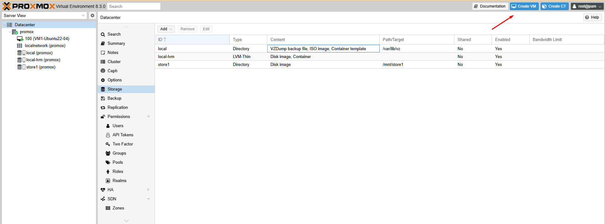

#### Bước 2: Tab General 

  + Node: Tên node promox máy ảo tạo vào
  + VM ID: Số thứ tự máy ảo được tạo (tính tại thời điểm tạo).Giá trị này thường sẽ nhận lần lượt + 1 trong quá trình vận hành
  + Name: Tên máy ảo

  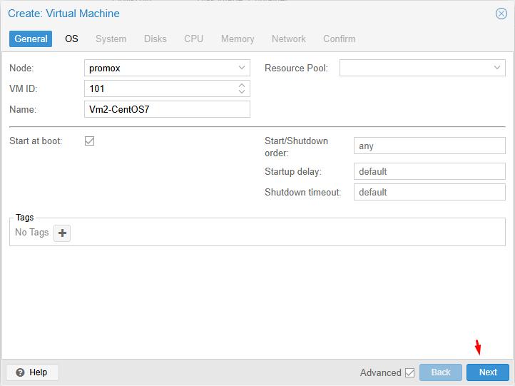

#### Bước 3: Tab OS 

Sử dụng 1 iso file để cài máy, ở đây có mục 
  + Storage: Storage local này được định nghĩa chứa iso - storage này tạo sẵn khi cài đặt proxmox
  + ISO image: Chọn loại ISO, lần này mình chọn CentOS7x64
  + Type OS : Linux
  + Version : Chọn kernel mới nhất 6.x
  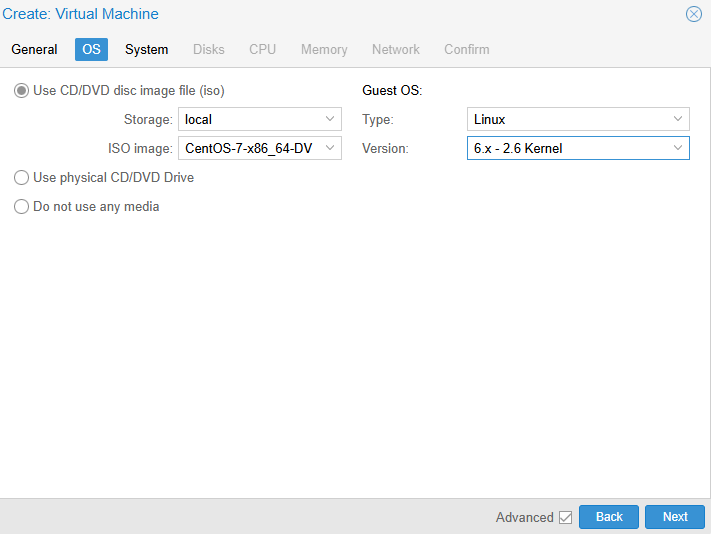

#### Bước 4: Tab System

  + Graphic card: Default
  + Machine: Default (i440fx)
  + BIOS: Default (SeaBIOS)
  + SCSI: chọn VirtIO SCSI
  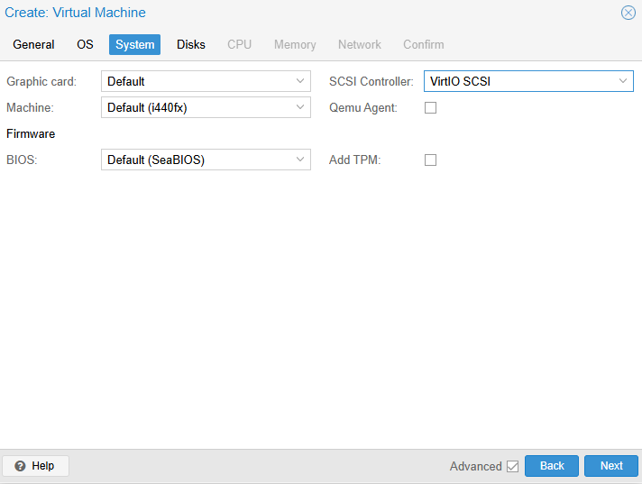

#### Bước 5: Tab Hard Disk

  + Bus/Device: chọn SCSI
  + Cache: Default (No cache)
  + Storage: chọn local-lvm
  + Disk size (GB): 20GB hoặc lớn hơn
  + Discard: tick chọn
  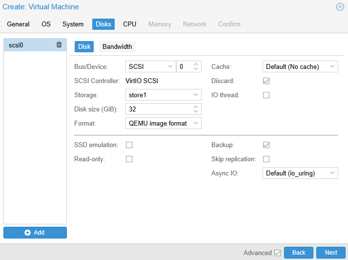

#### Bước 6: Tab CPU

  + Sockets: 1
  + Cores: 1
  + Type: Default (kvm64)

  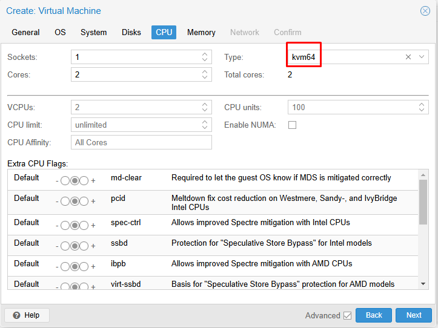

#### Bước 7: Tab Memory

Chọn số theo kích thước MB

  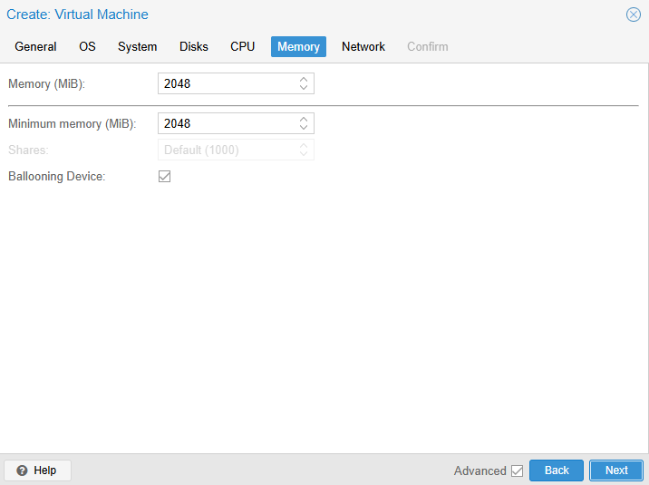

#### Bước 8: Tab Network – Mạng

Để default

  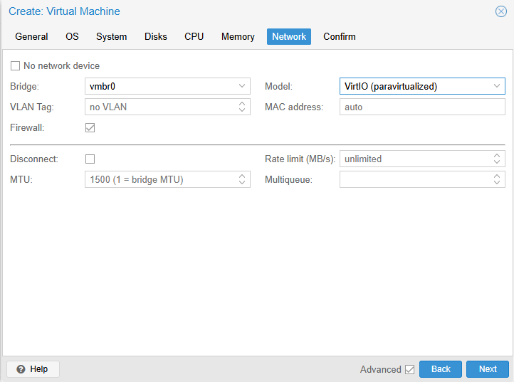

#### Bước 9: Confirm

Tích chọn ``Start after created`` , xem lại về cấu hình máy ảo và xác nhận ``Finish``

  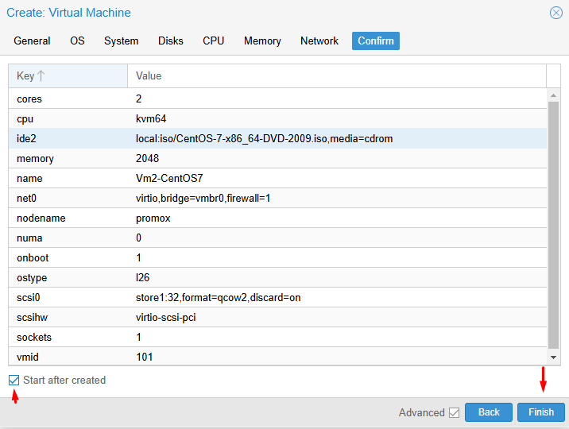

#### Bước 10: Cài đặt OS

Click vào ``ID VM`` > ``Console` để bắt đầu quá trình cài đặt

  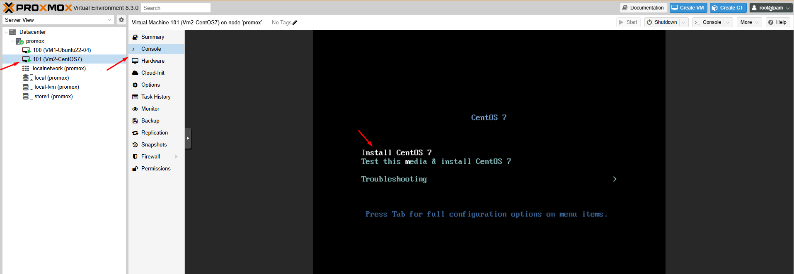

  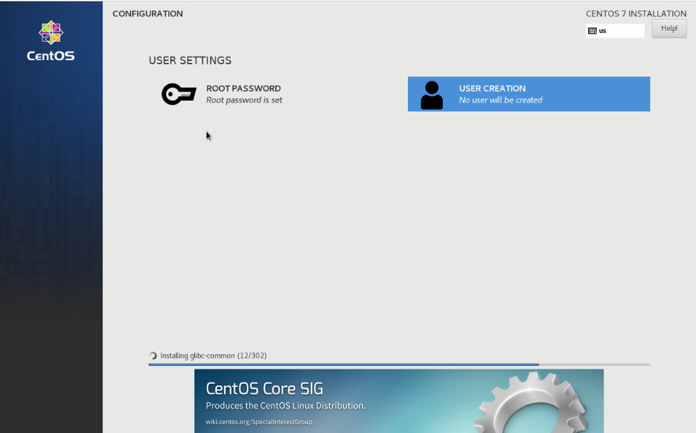