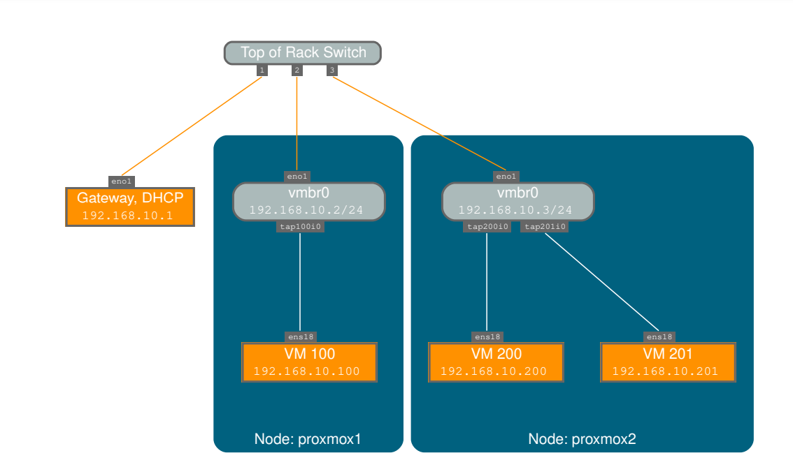
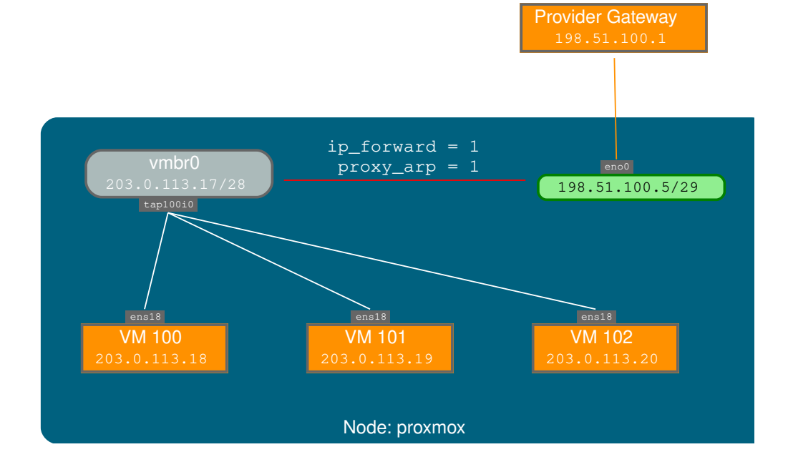
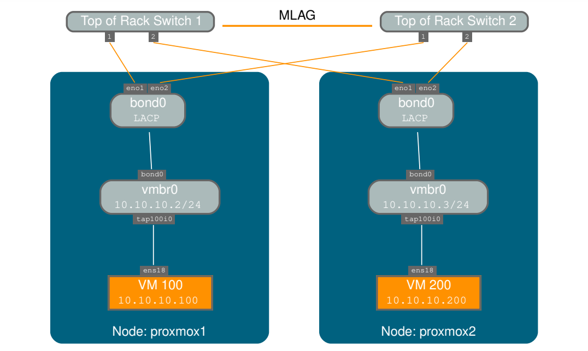

## 1. Network configtion

Proxmox VE sử dụng stack mạng Linux. Điều này cung cấp rất nhiều tính linh hoạt về cách thiết lập mạng trên các nút Proxmox VE. Cấu hình có thể được thực hiện thông qua GUI hoặc bằng cách chỉnh sửa thủ công tệp /etc/network/interfaces, chứa toàn bộ cấu hình mạng.
có mô tả định dạng đầy đủ. Tất cả các công cụ Proxmox VE đều cố gắng hết sức để giữ nguyên các sửa đổi trực tiếp của người dùng, nhưng sử dụng GUI vẫn được ưu tiên hơn, vì nó bảo vệ bạn khỏi các lỗi.
Cần có giao diện cầu nối Linux (thường được gọi là vmbrX) để kết nối khách với mạng vật lý bên dưới. Có thể coi nó như một công tắc ảo mà khách và giao diện vật lý được kết nối
vào. Phần này cung cấp một số ví dụ về cách mạng có thể được thiết lập để phù hợp với các trường hợp sử dụng khác nhau như dự phòng với liên kết, vlan hoặc định tuyến và thiết lập NAT.

Không nên sử dụng các công cụ Debian truyền thống ifup và ifdown nếu không chắc chắn, vì chúng có một số
bẫy như làm gián đoạn tất cả lưu lượng truy cập của khách trên ifdown vmbrX nhưng không kết nối lại các khách đó
khi thực hiện ifup trên cùng một cây cầu sau đó.

## 2. Apply Network Changes

Proxmox VE không ghi trực tiếp các thay đổi vào ``/etc/network/interfaces``. Thay vào đó, Proxmox ghi vào
một tệp tạm thời có tên là ``/etc/network/interfaces.new``, theo cách này, bạn có thể thực hiện nhiều thay đổi liên quan cùng
một lúc. Điều này cũng cho phép đảm bảo các thay đổi của bạn là chính xác trước khi áp dụng, vì cấu hình mạng không đúng
có thể khiến một nút không thể truy cập được.

#### Tải lại mạng trực tiếp bằng ``ifupdown2``

Với gói ifupdown2 được đề xuất (mặc định cho các cài đặt mới kể từ Proxmox VE 7.0), bạn có thể
áp dụng các thay đổi cấu hình mạng mà không cần khởi động lại. Nếu bạn thay đổi cấu hình mạng thông qua GUI,
bạn có thể nhấp vào nút Áp dụng cấu hình. Thao tác này sẽ di chuyển các thay đổi từ tệp ``/etc/network/interfaces.new``
sang ``/etc/network/interfaces`` và áp dụng chúng trực tiếp.
Nếu bạn thực hiện thay đổi thủ công trực tiếp vào tệp ``/etc/network/interfaces``, bạn có thể áp dụng chúng bằng cách
chạy 

    ifreload -a

#### Lưu ý

Nếu bạn đã cài đặt Proxmox VE trên Debian hoặc nâng cấp lên Proxmox VE 7.0 từ bản cài đặt Proxmox VE cũ hơn
, hãy đảm bảo ifupdown2 đã được cài đặt: 

    apt install ifupdown2

#### Khởi động lại Node để áp dụng

Một cách khác để áp dụng cấu hình mạng mới là khởi động lại node. Trong trường hợp đó, dịch vụ systemd
pvenetcommit sẽ kích hoạt tệp staging interfaces.new trước khi dịch vụ mạng áp dụng cấu hình đó.

## Quy ước đặt tên cấu hình mạng - Naming Conventions

Proxmox hiện đang sử dụng các quy ước đặt tên sau cho tên thiết bị:

  + Thiết bị Ethernet: en*, tên giao diện mạng systemd. Sơ đồ đặt tên này được sử dụng cho các cài đặt Proxmox
VE mới kể từ phiên bản 5.0.

  + Thiết bị Ethernet: eth[N], trong đó 0 ≤ N (eth0, eth1, . . . ) Sơ đồ đặt tên này được sử dụng cho các máy chủ Proxmox
VE được cài đặt trước bản phát hành 5.0. Khi nâng cấp lên 5.0, tên được giữ nguyên.

  + Tên cầu nối: Thường là vmbr[N], trong đó 0 ≤ N ≤ 4094 (vmbr0 - vmbr4094), nhưng bạn có thể sử dụng bất kỳ
chuỗi chữ số nào bắt đầu bằng một ký tự và dài tối đa 10 ký tự.

  + Bonds: bond[N], trong đó 0 ≤ N (bond0, bond1, . . . )

  + VLAN: Chỉ cần thêm số VLAN vào tên thiết bị, phân tách bằng dấu chấm (eno1.50, bond1.30)

Điều này giúp gỡ lỗi các sự cố mạng dễ dàng hơn, vì tên thiết bị ngụ ý loại thiết bị.

## 3. Tên giao diện mạng Systemd - Systemd Network Interface Names

Systemd định nghĩa một lược đồ đặt tên theo phiên bản cho tên thiết bị mạng. Lược đồ sử dụng tiền tố en hai ký tự cho các thiết bị mạng Ethernet. Các ký tự tiếp theo phụ thuộc vào trình điều khiển thiết bị, vị trí thiết bị và các thuộc tính khác. Một số mẫu có thể là

  + <index>[n<phys_port_name>|d<dev_port>] — devices on board

  + s<slot>[f<function>][n<phys_port_name>|d<dev_port>] — devices by hotplug id

  + [P<domain>]p<bus>s<slot>[f<function>][n<phys_port_name>|d<dev_port>] —
    devices by bus id

  + x<MAC> — devices by MAC address

Some examples for the most common patterns are:

  + eno1 — is the first on-board NIC

  + enp3s0f1 — is function 1 of the NIC on PCI bus 3, slot 0

## 4. Lựa chọn loại cấu hình mạng - Choosing a network configuration

Tùy thuộc vào tổ chức mạng hiện tại và tài nguyên của bạn, bạn có thể chọn thiết lập mạng bắc cầu (``bridged``), định tuyến (``routed``) hoặc ngụy trang (``masquerading``).

#### Máy chủ Proxmox VE trong mạng LAN riêng, sử dụng cổng ngoài để truy cập internet

Mô hình Bridged có ý nghĩa nhất trong trường hợp này và đây cũng là chế độ mặc định trên các cài đặt Proxmox
VE mới. Mỗi hệ thống Guest của bạn sẽ có một giao diện ảo được gắn vào cầu Proxmox VE.
Về hiệu ứng, điều này tương tự như việc kết nối trực tiếp card mạng Guest với một công tắc mới trên mạng LAN của bạn, máy chủ Proxmox VE đóng vai trò là ``switch``.

#### Máy chủ Proxmox VE tại nhà cung cấp dịch vụ lưu trữ, với các dải IP công khai cho Khách

Đối với thiết lập này, bạn có thể sử dụng mô hình ``Bridged`` hoặc ``Routed``, tùy thuộc vào những gì nhà cung cấp của bạn cho phép.

#### Máy chủ Proxmox VE tại nhà cung cấp dịch vụ lưu trữ, với một địa chỉ IP công khai duy nhất

Trong trường hợp này, cách duy nhất để có được quyền truy cập mạng đi cho hệ thống khách của bạn là sử dụng Masquerading.
Đối với quyền truy cập mạng đến cho khách của bạn, bạn sẽ cần cấu hình Port Forwarding.
Để linh hoạt hơn, bạn có thể cấu hình VLAN (IEEE 802.1q) và liên kết mạng, còn được gọi là "liên kết
tổng hợp". Theo cách đó, có thể xây dựng các mạng ảo phức tạp và linh hoạt.

## 5. Default Configuration using a Bridge

  

Bridge giống như các thiết bị chuyển mạch mạng vật lý được triển khai trong phần mềm. Tất cả các máy khách ảo có thể chia sẻ một bridge duy nhất hoặc bạn có thể tạo nhiều bridge để phân tách các miền mạng. Mỗi máy chủ có thể có tối đa 4094
bridge.
Chương trình cài đặt tạo một bridge duy nhất có tên vmbr0, được kết nối với card Ethernet đầu tiên. Cấu hình tương ứng trong ``/etc/network/interfaces`` có thể trông như thế này:

    auto lo

    iface lo inet loopback

    iface eno1 inet manual

    auto vmbr0
    iface vmbr0 inet static
        address 192.168.10.2/24
        gateway 192.168.10.1
        bridge-ports eno1
        bridge-stp off
        bridge-fd 0

Máy ảo hoạt động như thể chúng được kết nối trực tiếp với mạng vật lý. Đến lượt mình, mạng xem mỗi máy ảo có MAC riêng, mặc dù chỉ có một cáp mạng kết nối
tất cả các VM này với mạng.

## 6. Routed Configuration

Hầu hết các nhà cung cấp dịch vụ lưu trữ không hỗ trợ thiết lập trên. Vì lý do bảo mật, họ vô hiệu hóa mạng ngay khi phát hiện nhiều địa chỉ MAC trên một giao diện duy nhất.

#### Mẹo

Một số nhà cung cấp cho phép bạn đăng ký thêm các MAC thông qua giao diện quản lý của họ. Điều này tránh được
vấn đề, nhưng có thể khó cấu hình vì bạn cần đăng ký một MAC cho mỗi VM của mình.
Bạn có thể tránh được vấn đề này bằng cách "định tuyến" tất cả lưu lượng truy cập qua một giao diện duy nhất. Điều này đảm bảo rằng tất cả các
gói mạng đều sử dụng cùng một địa chỉ MAC.

  

Một kịch bản phổ biến là bạn có một IP công khai (giả sử 198.51.100.5 cho ví dụ này) và một khối IP bổ sung cho các máy ảo (VM) của bạn (203.0.113.16/28). Chúng tôi khuyên bạn nên thiết lập sau cho những tình huống như vậy:

    auto lo
    iface lo inet loopback

    auto eno0
    iface eno0 inet static
        address 198.51.100.5/29
        gateway 198.51.100.1
        post-up echo 1 > /proc/sys/net/ipv4/ip_forward
        post-up echo 1 > /proc/sys/net/ipv4/conf/eno0/proxy_arp

    auto vmbr0
    iface vmbr0 inet static
        address 203.0.113.17/28
        bridge-ports none
        bridge-stp off
        bridge-fd 0

## 7. Masquerading (NAT) with iptables

Việc ngụy trang (``Masquerading``)cho phép khách chỉ có địa chỉ IP riêng truy cập mạng bằng cách sử dụng địa chỉ IP của máy chủ
cho lưu lượng truy cập đi. Mỗi gói tin đi được iptables ghi lại để xuất hiện như là bắt nguồn từ
máy chủ, và các phản hồi được ghi lại theo đó để định tuyến đến người gửi ban đầu.

    auto lo
    iface lo inet loopback

    auto eno1
    #real IP address
    iface eno1 inet static
        address 198.51.100.5/24
        gateway 198.51.100.1

    auto vmbr0
    #private sub network
    iface vmbr0 inet static

        address 10.10.10.1/24
        bridge-ports none
        bridge-stp off
        bridge-fd 0
        post-up echo 1 > /proc/sys/net/ipv4/ip_forward
        post-up iptables -t nat -A POSTROUTING -s '10.10.10.0/24' -o eno1 ←-
        -j MASQUERADE
        post-down iptables -t nat -D POSTROUTING -s '10.10.10.0/24' -o eno1 ←-
        j MASQUERADE

#### Lưu ý

Trong một số thiết lập ngụy trang có tường lửa được bật, các vùng conntrack có thể cần thiết cho các kết nối đi. Nếu không, tường lửa có thể chặn các kết nối đi vì chúng sẽ ưu tiên POSTROUTING
của bridge VM (và không phải MASQUERADE).

Thêm những dòng này vào ``/etc/network/interfaces`` có thể khắc phục được sự cố này:

    post-up iptables -t raw -I PREROUTING -i fwbr+ -j CT --zone 1
    post-down iptables -t raw -D PREROUTING -i fwbr+ -j CT --zone 1

## 8. Linux Bond

Liên kết (còn gọi là nhóm NIC hoặc Liên kết tổng hợp) là một kỹ thuật liên kết nhiều NIC với một thiết bị mạng duy nhất. Có thể đạt được các mục tiêu khác nhau, như làm cho mạng có khả năng chịu lỗi, tăng
hiệu suất hoặc cả hai cùng nhau.

Phần cứng tốc độ cao như Fibre Channel và phần cứng chuyển mạch liên quan có thể khá tốn kém. Bằng cách thực hiện liên kết tổng hợp, hai NIC có thể xuất hiện như một giao diện logic, dẫn đến tốc độ gấp đôi. Đây là một
tính năng hạt nhân Linux gốc được hỗ trợ bởi hầu hết các bộ chuyển mạch. Nếu các nút của bạn có nhiều cổng Ethernet,

Bạn có thể phân phối các điểm lỗi của mình bằng cách chạy cáp mạng đến các bộ chuyển mạch khác nhau và kết nối được liên kết sẽ chuyển sang một cáp hoặc cáp khác trong trường hợp có sự cố mạng.
Các liên kết tổng hợp có thể cải thiện độ trễ di chuyển trực tiếp và cải thiện tốc độ sao chép dữ liệu giữa các nút Proxmox VE Cluster.

#### Có 7 chế độ liên kết:

  + Round-robin (balance-rr): Truyền các gói tin mạng theo thứ tự tuần tự từ slave giao diện mạng (NIC) khả dụng đầu tiên đến slave cuối cùng. Chế độ này cung cấp khả năng cân bằng tải và khả năng chịu lỗi.

  + Active-backup (active-backup): Chỉ có một slave NIC trong liên kết đang hoạt động. Một slave khác sẽ trở thành
    hoạt động nếu và chỉ nếu slave đang hoạt động bị lỗi. Địa chỉ MAC của giao diện liên kết logic duy nhất chỉ có thể nhìn thấy bên ngoài trên một NIC (cổng) để tránh bị bóp méo trong bộ chuyển mạch mạng. Chế độ này cung cấp khả năng chịu lỗi.

  + XOR (balance-xor): Truyền các gói tin mạng dựa trên [(địa chỉ MAC nguồn XOR với địa chỉ MAC đích) modulo số lượng slave NIC]. Chế độ này chọn cùng một slave NIC cho mỗi địa chỉ MAC đích. Chế độ này cung cấp khả năng cân bằng tải và khả năng chịu lỗi.

  + Broadcast (phát sóng): Truyền các gói tin mạng trên tất cả các giao diện mạng slave. Chế độ này cung cấp
    khả năng chịu lỗi.

  + Tổng hợp liên kết động IEEE 802.3ad (802.3ad) (LACP): Tạo các nhóm tổng hợp chia sẻ
    cùng tốc độ và cài đặt song công. Sử dụng tất cả các giao diện mạng phụ trong nhóm tổng hợp đang hoạt động
    theo thông số kỹ thuật 802.3ad.

  + Cân bằng tải truyền thích ứng (balance-tlb): Chế độ trình điều khiển liên kết Linux không yêu cầu bất kỳ
    hỗ trợ chuyển mạch mạng đặc biệt nào. Lưu lượng gói mạng đi được phân phối theo
    tải hiện tại (tính theo tốc độ) trên mỗi giao diện mạng phụ. Lưu lượng đến được nhận bởi một
    giao diện mạng phụ hiện được chỉ định. Nếu giao diện phụ nhận này bị lỗi, một giao diện phụ khác sẽ tiếp quản địa chỉ MAC
    của giao diện phụ nhận bị lỗi.

  + Cân bằng tải thích ứng (balance-alb): Bao gồm balance-tlb cộng với cân bằng tải nhận (rlb) cho lưu lượng IPV4
    và không yêu cầu bất kỳ hỗ trợ chuyển mạch mạng đặc biệt nào. Cân bằng tải nhận được thực hiện bằng
    thương lượng ARP. Trình điều khiển liên kết chặn các Phản hồi ARP do hệ thống cục bộ gửi trên đường ra
    và ghi đè địa chỉ phần cứng nguồn bằng địa chỉ phần cứng duy nhất của một trong các nô lệ NIC trong
    giao diện liên kết logic duy nhất sao cho các đối tác mạng khác nhau sử dụng các địa chỉ MAC khác nhau cho
    lưu lượng gói mạng của họ.

Nếu chuyển mạch của bạn hỗ trợ giao thức LACP (IEEE 802.3ad), thì bạn nên sử dụng
chế độ liên kết tương ứng (802.3ad). Nếu không, bạn thường nên sử dụng chế độ sao lưu chủ động.
Đối với mạng cụm (Corosync), chúng tôi khuyên bạn nên định cấu hình nó với nhiều mạng. Corosync không
cần liên kết để dự phòng mạng vì nó có thể tự chuyển đổi giữa các mạng nếu một mạng không sử dụng được.
Cấu hình liên kết sau có thể được sử dụng làm mạng lưu trữ phân tán/chia sẻ. Lợi ích sẽ là
bạn sẽ có tốc độ cao hơn và mạng sẽ có khả năng chịu lỗi.

#### Ví dụ bond sử dụng mix IP

    auto lo
    iface lo inet loopback

    iface eno1 inet manual

    iface eno2 inet manual

    iface eno3 inet manual

    auto bond0
    iface bond0 inet static
        bond-slaves eno1 eno2
        address 192.168.1.2/24
        bond-miimon 100
        bond-mode 802.3ad
        bond-xmit-hash-policy layer2+3

    auto vmbr0
    iface vmbr0 inet static

        address 10.10.10.2/24
        gateway 10.10.10.1
        bridge-ports eno3
        bridge-stp off
        bridge-fd 0

  

Một khả năng khác là sử dụng liên kết trực tiếp làm cổng cầu nối. Điều này có thể được sử dụng để làm cho mạng khách
có khả năng chịu lỗi.

#### Ví dụ bond sử dụng bridge

    auto lo
    iface lo inet loopback

    iface eno1 inet manual

    iface eno2 inet manual

    auto bond0
    iface bond0 inet manual
        bond-slaves eno1 eno2
        bond-miimon 100
        bond-mode 802.3ad
        bond-xmit-hash-policy layer2+3

    auto vmbr0
    iface vmbr0 inet static
        address 10.10.10.2/24
        gateway 10.10.10.1
        bridge-ports bond0
        bridge-stp off
        bridge-fd 0

## 9. VLAN802.1Q

LAN ảo (VLAN) là một miền phát sóng được phân vùng và cô lập trong mạng ở lớp hai. Vì vậy, có thể có nhiều mạng (4096) trong một mạng vật lý, mỗi mạng độc lập với nhau.
Mỗi mạng VLAN được xác định bằng một số thường được gọi là thẻ. Các gói mạng sau đó được gắn thẻ để xác định
mạng ảo nào chúng thuộc về

#### VLAN cho Mạng Khách

Proxmox VE hỗ trợ thiết lập này ngay khi cài đặt. Bạn có thể chỉ định thẻ VLAN khi tạo VM.
Thẻ VLAN là một phần của cấu hình mạng khách. Lớp mạng hỗ trợ các chế độ khác nhau để
triển khai VLAN, tùy thuộc vào cấu hình cầu nối:

  + Nhận biết VLAN trên cầu nối Linux: Trong trường hợp này, mỗi card mạng ảo của khách được gán cho
một thẻ VLAN, được cầu nối Linux hỗ trợ một cách minh bạch. Chế độ Trunk cũng khả thi, nhưng điều đó
khiến cấu hình trong máy khách trở nên cần thiết.

  + VLAN "truyền thống" trên cầu nối Linux: Ngược lại với phương pháp nhận biết VLAN, phương pháp này không
minh bạch và tạo ra một thiết bị VLAN có cầu nối liên kết cho mỗi VLAN. Nghĩa là, tạo một máy khách trên
VLAN 5 chẳng hạn, sẽ tạo ra hai giao diện eno1.5 và vmbr0v5, sẽ duy trì cho đến khi khởi động lại
xảy ra.

  + Open vSwitch VLAN: Chế độ này sử dụng tính năng OVS VLAN.

  + Guest configure VLAN: VLAN được chỉ định bên trong guest. Trong trường hợp này, thiết lập được thực hiện hoàn toàn
bên trong guest và không thể bị ảnh hưởng từ bên ngoài. Lợi ích là bạn có thể sử dụng nhiều
hơn một VLAN trên một NIC ảo duy nhất.
