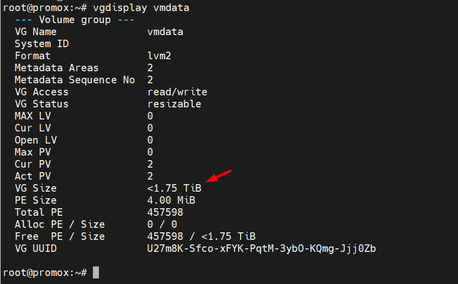
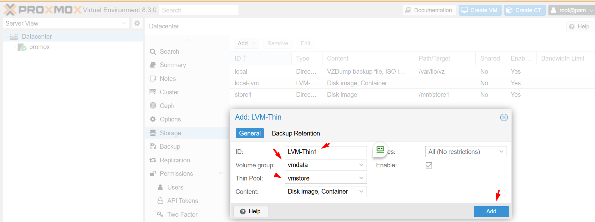

## 1. Logical Volume Manager (LVM)

Hầu hết mọi người cài đặt Proxmox VE trực tiếp trên đĩa cục bộ. Đĩa CD cài đặt Proxmox VE cung cấp một số
tùy chọn để quản lý đĩa cục bộ và thiết lập mặc định hiện tại sử dụng LVM. Trình cài đặt cho phép bạn chọn một
đĩa duy nhất cho thiết lập đó và sử dụng đĩa đó làm ổ đĩa vật lý cho Nhóm ổ đĩa (VG) pve.
Đầu ra sau đây là từ một cài đặt thử nghiệm sử dụng đĩa 450GB SSD :

    root@promox:~# pvs
      PV         VG  Fmt  Attr PSize    PFree
      /dev/sda3  pve lvm2 a--  <445.62g 16.00g

    root@promox:~# vgs
      VG  #PV #LV #SN Attr   VSize    VFree
      pve   1   4   0 wz--n- <445.62g 16.00g

    root@promox:~# lvs
      LV            VG  Attr       LSize    Pool Origin Data%  Meta%  Move Log Cpy%Sync Convert
      data          pve twi-aotz-- <319.11g             0.00   0.53
      root          pve -wi-ao----   96.00g
      swap          pve -wi-ao----    8.00g
      vm-100-disk-0 pve Vwi-a-tz--   20.00g data        0.00

  + pvs: Liệt kê các Physical Volume (PV) trong hệ thống.
    Các thông tin hiển thị bao gồm: Tên PV, Volume Group (VG), Dung lượng (Size), Dung lượng đã dùng (Used), Dung lượng trống (Free).
  + vgs: Liệt kê các Volume Group (VG) trong hệ thống.
    Các thông tin hiển thị bao gồm: Tên VG, số Logical Volume (LV), số Snapshot (SN), Attribute, Dung lượng (VSize), Dung lượng trống (VFree).
  + lvs: Liệt kê các Logical Volume (LV) trong hệ thống.
    Các thông tin hiển thị bao gồm: Tên LV, Tên VG, Attribute, Dung lượng (LSize), Pool Origin, Data%, Meta%, Move Log, Cp%Sync, Convert.

#### 1.1 - root

Được định dạng là ext4 và chứa hệ điều hành.

#### 1.2 - swap

Swap partition 

#### 1.3 - data ``/var/lib/vz/``

Ổ đĩa này sử dụng LVM-thin và được dùng để lưu trữ hình ảnh VM. LVM-thin được ưu tiên cho tác vụ này,
vì nó cung cấp hỗ trợ hiệu quả cho ảnh chụp nhanh và bản sao.
Đối với Proxmox VE phiên bản lên đến 4.1, trình cài đặt tạo một ổ đĩa logic chuẩn có tên là ``data``, được
gắn kết tại /var/lib/vz.
Bắt đầu từ phiên bản 4.2, ổ đĩa logic ``data`` là một nhóm LVM-thin, được dùng để lưu trữ hình ảnh khách dựa trên khối và /var/lib/vz chỉ đơn giản là một thư mục trên hệ thống tệp gốc.

    cd /var/lib/vz/
    root@promox:/var/lib/vz# ls -lah
    drwxr-x-x  2 root root 4.0K Mar  4 15:40 dump
    drwxr-xr-x  2 root root 4.0K Nov 20 17:39 images
    drwxr-xr-x  4 root root 4.0K Mar  4 15:30 template

## 2. Creating a Volume Group

Chúng ta có 1 ổ trống /dev/sdc, và chúng ta muốn tạo một nhóm ổ đĩa có tên là
``vmdata``.

#### Chú ý:
Xin lưu ý rằng các lệnh sau sẽ xóa toàn bộ dữ liệu hiện có trên /dev/sdc.

#### 2.1 - Tạo bảng phân vùng GPT trên ổ đĩa

    parted /dev/sdc mklabel gpt
       Warning: The existing disk label on /dev/sdc will be destroyed and all data on this disk will be lost. Do you want to continue?
       Yes/No? Yes
       Information: You may need to update /etc/fstab.

#### 2.2 - Tạo một phân vùng /dev/sdc1

    root@promox:~# sgdisk -N 1 /dev/sdc
      The operation has completed successfully.

#### 2.3 - Tạo một Physical Volume (PV) không cần xác nhận và metadatasize 250K.

    root@promox:~# pvcreate --metadatasize 250k -y -ff /dev/sdc1
      Physical volume "/dev/sdc1" successfully created.

#### 2.4 -Tạo một nhóm volume có tên ``vmdata`` trên /dev/sdc1

    root@promox:~# vgcreate vmdata /dev/sdc1
      Volume group "vmdata" successfully created

#### 2.5 Join ``/dev/sdd1`` vào ``VG vmdata``:

    root@promox:~# vgextend vmdata /dev/sdd1
      Volume group "vmdata" successfully extended

#### 2.6 - Kiểm tra lại trạng thái của ``VG vmdata``:

  

Chúng ta tạo được 1 ``VG vmdata``có dung lượng 1.75 TB

## 3. Creating an extra LV for /var/lib/vz

This can be easily done by creating a new thin LV.

    # lvcreate -n <Name> -V <Size[M,G,T]> <VG>/<LVThin_pool>

A real world example:

    # lvcreate -n vz -V 10G pve/data

Now a filesystem must be created on the LV.

    # mkfs.ext4 /dev/pve/vz

At last this has to be mounted.

#### Warning:be sure that /var/lib/vz is empty. On a default installation it’s not.

To make it always accessible add the following line in /etc/fstab.

    # echo '/dev/pve/vz /var/lib/vz ext4 defaults 0 2' >> /etc/fstab

## 4 .Resizing the thin pool

Resize the LV and the metadata pool with the following command:

    # lvresize --size +<size[\M,G,T]> --poolmetadatasize +<size[\M,G]> <VG>/<LVThin_pool>

#### Note: when extending the data pool, the metadata pool must also be extended.

## 5. Create a LVM-thin pool

LVM-thin pool là một tính năng của Logical Volume Management (LVM) cho phép tạo ra các Logical Volume (LV) động, có thể tăng/giảm kích thước khi cần thiết.

LVM-thin pool cho phép tạo ra một "pool" các không gian lưu trữ ảo (thin pool), thay vì các LV cố định.

Các LV được tạo từ thin pool này được gọi là "thin LV".

Thin LV chỉ sử dụng không gian lưu trữ thực khi dữ liệu được ghi vào, thay vì cấp phát không gian lưu trữ tĩnh như truyền thống.

Điều này giúp tối ưu hóa việc sử dụng không gian lưu trữ, đồng thời cung cấp khả năng mở rộng linh hoạt.

    root@promox:~# lvcreate -L 80G -T -n vmstore vmdata
      Thin pool volume with chunk size 64.00 KiB can address at most <15.88 TiB of data.
      Logical volume "vmstore" created.

Giải thích:

  + ``lvcreate``: Lệnh để tạo Logical Volume (LV).
  + -L 80G: Tạo LV với kích thước 80GB.
  + -T: Chỉ định tạo LV thin (từ thin pool).
  + -n vmstore: Đặt tên LV là ``vmstore``.
  + ``vmdata``: Tên của Volume Group (VG) mà LV ``vmstore`` sẽ được tạo trong đó.

Định dạng ext4

    root@promox:~# mkfs.ext4 /dev/vmdata/vmstore

    

Sau đó chúng ta quay lại giao diện admin Proxmox để tạo 1 ``Storage`` type  ``LVM-Thin``

  