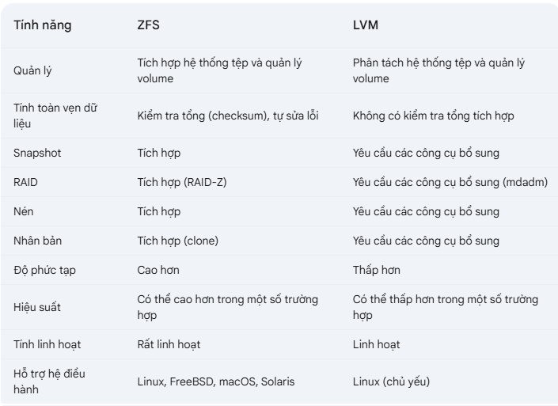

## ZFS on Linux
ZFS là hệ thống tập tin kết hợp và trình quản lý ổ đĩa logic do Sun Microsystems thiết kế. Bắt đầu với
Proxmox VE 3.4, cổng hạt nhân Linux gốc của hệ thống tập tin ZFS được giới thiệu là hệ thống tập tin tùy chọn và
cũng là lựa chọn bổ sung cho hệ thống tập tin gốc. Không cần phải biên dịch thủ công các mô-đun ZFS.
Bằng cách sử dụng ZFS, có thể đạt được các tính năng doanh nghiệp tối đa với phần cứng giá rẻ, nhưng cũng có hệ thống hiệu suất cao bằng cách tận dụng bộ nhớ đệm SSD hoặc thậm chí chỉ thiết lập SSD. ZFS có thể thay thế các card raid phần cứng tốn kém bằng tải CPU và bộ nhớ vừa phải kết hợp với khả năng quản lý dễ dàng.

ƯU ĐIỂM CHUNG CỦA ZFS:

  + Easy configuration and management with Proxmox VE GUI and CLI.
  + Reliable
  + Protection against data corruption
  + Data compression on file system level
  + Snapshots
  + Copy-on-write clone
  + Various raid levels: RAID0, RAID1, RAID10, RAIDZ-1, RAIDZ-2, RAIDZ-3, dRAID, dRAID2, dRAID3
  + Can use SSD for cache
  + Self healing
  + Continuous integrity checking
  + Designed for high storage capacities
  + Asynchronous replication over network
  + Open Source
  + Encryption
  + . . .

Bảng so sánh ZFS và LVM \

  

### 1.1 - Hardware

ZFS phụ thuộc rất nhiều vào bộ nhớ, vì vậy bạn cần ít nhất 8GB để bắt đầu. Trên thực tế, hãy sử dụng càng nhiều càng tốt
cho phần cứng/ngân sách của bạn. Để ngăn ngừa hỏng dữ liệu, chúng tôi khuyên bạn nên sử dụng RAM ECC chất lượng cao.
Nếu bạn sử dụng bộ nhớ đệm chuyên dụng và/hoặc đĩa nhật ký, bạn nên sử dụng SSD cấp doanh nghiệp. Điều này có thể làm tăng đáng kể
hiệu suất tổng thể.

#### Quan trọng

Không sử dụng ZFS trên bộ điều khiển RAID phần cứng có quản lý bộ nhớ đệm riêng. ZFS
cần giao tiếp trực tiếp với các đĩa. Bộ điều hợp HBA hoặc thứ gì đó như bộ điều khiển LSI
được flash ở chế độ "IT" sẽ phù hợp hơn.

Nếu bạn đang thử nghiệm cài đặt Proxmox VE bên trong VM (Nested Virtualization), đừng sử dụng
virtio cho các đĩa của VM đó vì chúng không được ZFS hỗ trợ. Thay vào đó, hãy sử dụng IDE hoặc SCSI (cũng hoạt động với
loại bộ điều khiển SCSI virtio).

### 1.2 - Installation as Root File System

Khi bạn cài đặt bằng trình cài đặt Proxmox VE, bạn có thể chọn ZFS cho hệ thống tệp gốc. Bạn cần
chọn loại RAID tại thời điểm cài đặt:

``RAID0`` Còn được gọi là "phân chia". Dung lượng của ổ đĩa như vậy là tổng dung lượng của tất cả
các đĩa. Nhưng RAID0 không thêm bất kỳ sự dự phòng nào, do đó, lỗi của một ổ đĩa duy nhất
khiến ổ đĩa không sử dụng được.

``RAID1`` Còn được gọi là "phản chiếu". Dữ liệu được ghi giống hệt nhau vào tất cả các đĩa. Chế độ này yêu cầu
ít nhất 2 đĩa có cùng kích thước. Dung lượng kết quả là dung lượng của một đĩa duy nhất.

``RAID10`` Kết hợp ``RAID0`` và ``RAID1``. Yêu cầu ít nhất 4 đĩa.

``RAIDZ-1`` Một biến thể của ``RAID-5``, chẵn lẻ đơn. Yêu cầu ít nhất 3 đĩa.

``RAIDZ-2`` Một biến thể của ``RAID-5``, chẵn lẻ đôi. Yêu cầu ít nhất 4 đĩa.

``RAIDZ-3`` Một biến thể của ``RAID-5``, chẵn lẻ ba. Cần ít nhất 5 đĩa.

Trình cài đặt tự động phân vùng các đĩa, tạo một nhóm ZFS có tên là rpool và cài đặt hệ thống tệp gốc
trên ổ đĩa phụ ZFS ``rpool/ROOT/pve-1``.

Một ổ đĩa phụ khác có tên là ``rpool/data`` được tạo để lưu trữ hình ảnh VM. Để sử dụng ổ đĩa đó với các công cụ
Proxmox VE, trình cài đặt tạo mục cấu hình sau trong ``/etc/pve/storage.cfg``

    cat /etc/pve/storage.cfg

## Cấu hình ZFS trên hệ thống Linux:

#### 1. Cài đặt ZFS:

Trên Ubuntu/Debian:

    sudo apt update
    sudo apt install zfsutils-linux

Trên CentOS/RHEL:

    sudo yum install epel-release
    sudo yum install zfs

#### 2. Xác định các ổ đĩa:

Sử dụng lệnh lsblk hoặc fdisk -l để xác định các ổ đĩa bạn muốn sử dụng cho ZFS.

#### 3. Tạo ZFS Pool:

Sử dụng lệnh zpool create để tạo một ZFS pool. Ví dụ:

    sudo zpool create mypool /dev/sdb /dev/sdc

mypool là tên của pool.

    /dev/sdb và /dev/sdc là các ổ đĩa.

Bạn có thể sử dụng các tùy chọn RAID-Z để tạo RAID:

    RAID-Z1: zpool create mypool raidz /dev/sdb /dev/sdc /dev/sdd (tương đương RAID 5)
    RAID-Z2: zpool create mypool raidz2 /dev/sdb /dev/sdc /dev/sdd /dev/sde (tương đương RAID 6)

#### 4. Tạo ZFS Dataset:

Sử dụng lệnh zfs create để tạo một ZFS dataset. Ví dụ:

    sudo zfs create mypool/mydataset
    mypool/mydataset là đường dẫn của dataset.

#### 5. Mount ZFS Dataset:

    ZFS dataset sẽ tự động được mount vào một thư mục có cùng tên. Bạn có thể thay đổi điểm mount nếu cần.

#### 6. Tạo Snapshot:

Sử dụng lệnh zfs snapshot để tạo một snapshot. Ví dụ:

    sudo zfs snapshot mypool/mydataset@snapshot1

#### 7. Khôi phục Snapshot:

Sử dụng lệnh zfs rollback để khôi phục một snapshot. Ví dụ:

    sudo zfs rollback mypool/mydataset@snapshot1

#### Lưu ý:

ZFS có rất nhiều tính năng nâng cao. Hãy đọc kỹ tài liệu hướng dẫn của ZFS để tìm hiểu thêm.
Cần cẩn thận khi cấu hình ZFS, vì các lỗi có thể dẫn đến mất dữ liệu.

## Nhận định cá nhân về ZFS

  + zfs chỉ triển khai trên cùng 1 cụm máy chủ

    ZFS thường được triển khai trên một cụm máy chủ. Điều này là do thiết kế của ZFS, tập trung vào việc quản lý lưu trữ cục bộ trên một hệ thống. Tuy nhiên, có những điểm cần làm rõ:

  + ZFS và tính phân tán:

    ZFS chủ yếu hoạt động ở cấp độ hệ thống tệp và quản lý volume trên một máy chủ đơn lẻ.

    Mặc dù ZFS rất mạnh mẽ trong việc quản lý lưu trữ cục bộ, nhưng nó không phải là một hệ thống lưu trữ phân tán theo cách mà Ceph hoặc các hệ thống lưu trữ phân tán khác hoạt động.

  + Sử dụng ZFS trong môi trường cụm:

    ZFS có thể được sử dụng trong môi trường cụm bằng cách chia sẻ các pool ZFS qua mạng.

    Điều này thường được thực hiện thông qua các giao thức như NFS (Network File System) hoặc iSCSI.

    Trong trường hợp này, một máy chủ sẽ đóng vai trò là máy chủ lưu trữ ZFS, và các máy chủ khác trong cụm sẽ kết nối đến nó để truy cập dữ liệu.

  + Các giải pháp như OpenZFS có những công cụ để hỗ trợ việc truyền tải dữ liệu qua mạng.

  + Các trường hợp sử dụng:

    ZFS thường được sử dụng trong các máy chủ lưu trữ NAS (Network Attached Storage), nơi nó cung cấp khả năng lưu trữ tin cậy và hiệu suất cao.
    Nó cũng được sử dụng trong các máy chủ ảo hóa, nơi nó cung cấp khả năng lưu trữ linh hoạt và hiệu quả cho các máy ảo.
    Tóm lại, mặc dù ZFS chủ yếu hoạt động ở cấp độ máy chủ đơn lẻ, nhưng nó có thể được sử dụng trong môi trường cụm bằng cách chia sẻ các pool ZFS qua mạng.