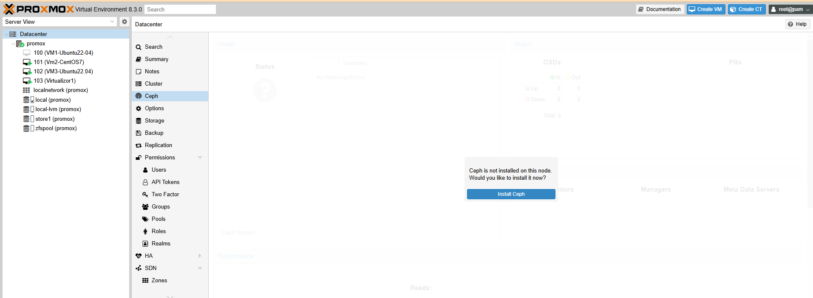
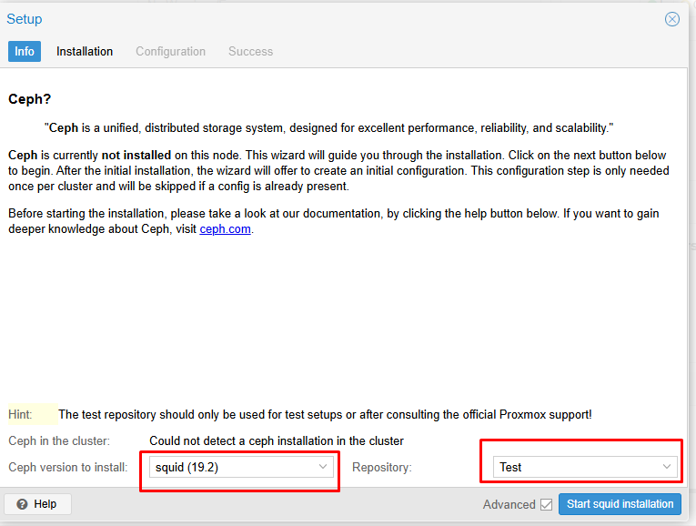
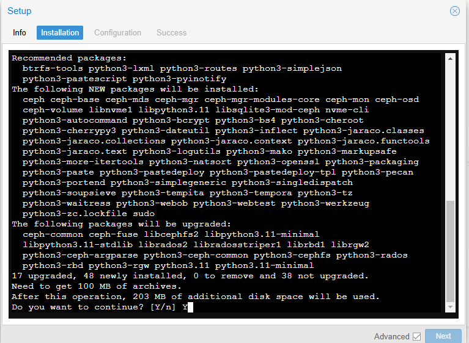
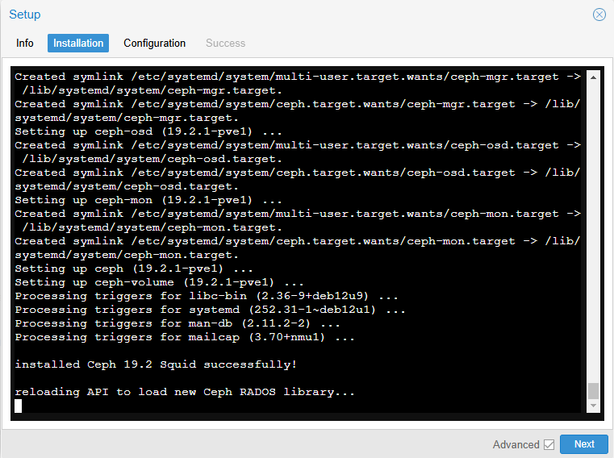
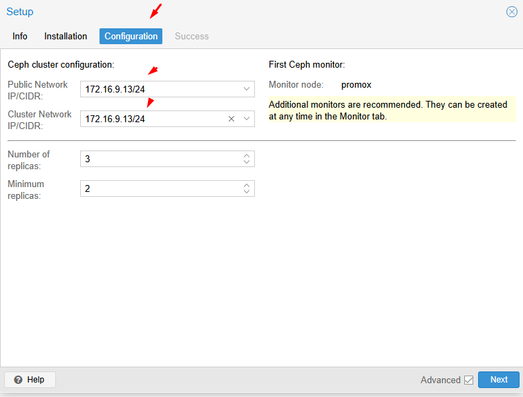
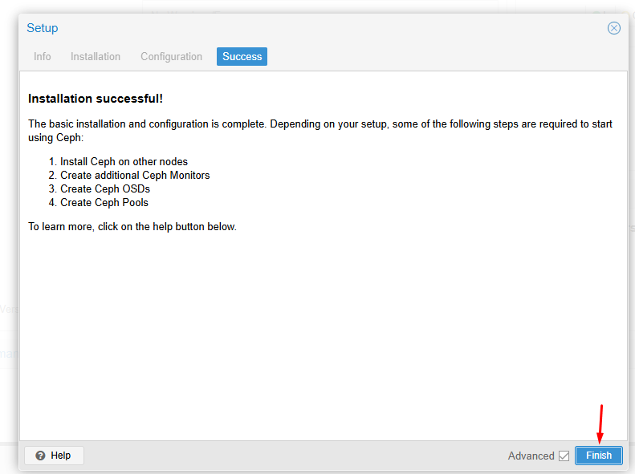
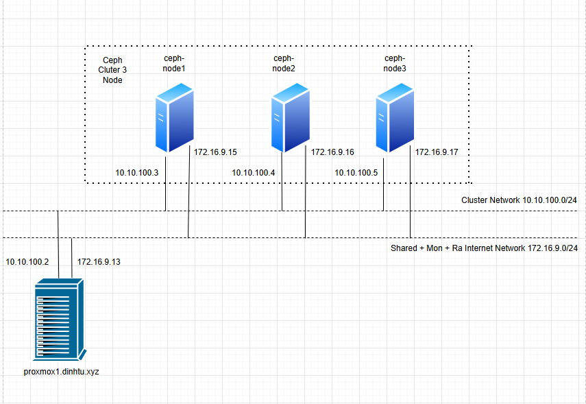
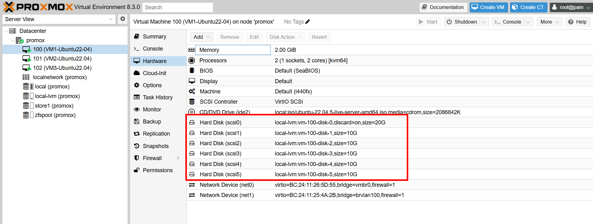

  

  

  

  

  

  

Nội dung gồm 2 phần là Proxmox kết nối Ceph bên ngoài và Ceph trên chính Proxmox   

## I - Proxmox connect Ceph bên ngoài

Trước tiên bạn hay nhìn vào IP quy hoạch của bài Lab của tôi như sau:

Dải mạng 10.10.100.0/24 là dải mạng Cluter Node Ceph

Dải mạng 172.16.9.0/24 là dải mạng chia sẻ storage + Mon + Ra Internet để cài đặt phần mềm của các node Ceph

  + IP proxmox: 10.10.100.2 + 172.16.9.13
  + IP Ceph node 1: 10.10.100.3 + 172.16.9.15
  + IP Ceph node 2: 10.10.100.4 + 172.16.9.16
  + IP Ceph node 3: 10.10.100.5 + 172.16.9.17

  

Mỗi Ceph trong cụm cluster mình thêm 5 ổ cứng 

  
  

