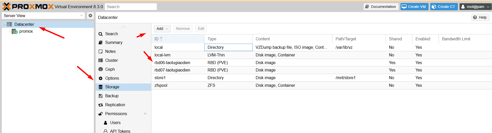
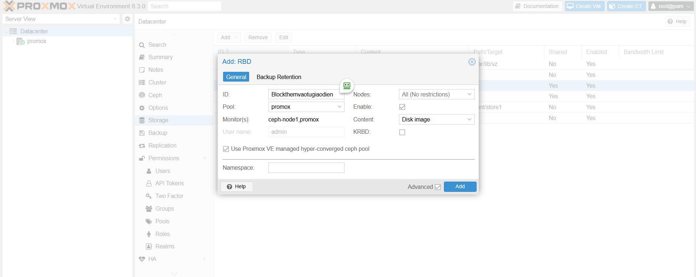
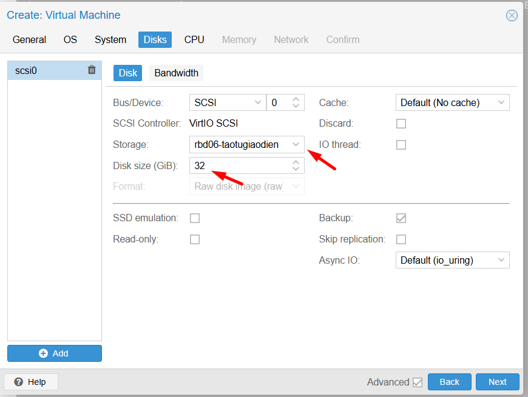
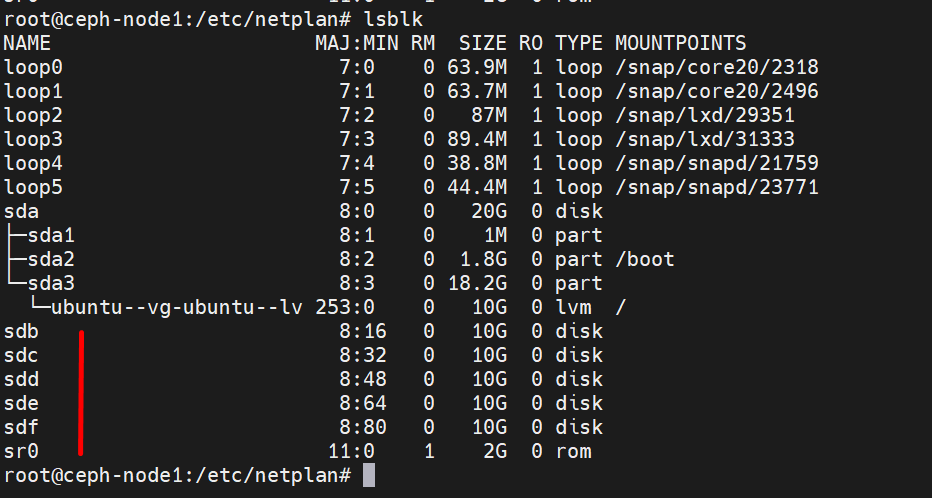
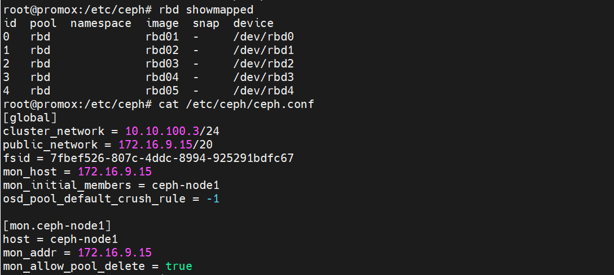

## I - Proxmox cài đặt Ceph qua giao diện

Dưới đây là các bước click chuột nhanh

  

  

  

  

  

  

Ảnh cuối cho thấy qua cài đặt tại giao diện, chúng ta thấy còn thiếu nhiều bước như:
 
  + Cài đặt Ceph trong node trong cụm Cluster
  + Cài đặt Ceph Mon
  + Cài đặt Ceph OSDs
  + Cài đặt Ceph pool

Tạm thời chưa cài thêm các bước trên, mình kiểm tra thử.

  

Tại Datacenter > Storage > Add > RDB 

  

Tạo thử VM

  

## II - Proxmox connect Ceph bên ngoài

Trước tiên bạn hay nhìn vào IP quy hoạch của bài Lab của tôi như sau:

Dải mạng 10.10.100.0/24 là dải mạng Cluter Node Ceph ( Node trong cụm chạy Ubuntu 22.04 Ceph Quincy )

Dải mạng 172.16.9.0/24 là dải mạng chia sẻ storage + Mon + Ra Internet để cài đặt phần mềm của các node Ceph

  + IP proxmox: 10.10.100.2 + 172.16.9.13
  + IP Ceph node 1: 10.10.100.3 + 172.16.9.15
  + IP Ceph node 2: 10.10.100.4 + 172.16.9.16
  + IP Ceph node 3: 10.10.100.5 + 172.16.9.17

  

Mỗi Ceph node trong cụm cluster mình thêm 5 ổ cứng 

  

  

Để thuận tiện cho việc LAB, mình tạm tắt firewall ufw.

Sau một hồi config, mình đã tạo pool tên rdb trên Ceph và map 5 block vào máy promox

  